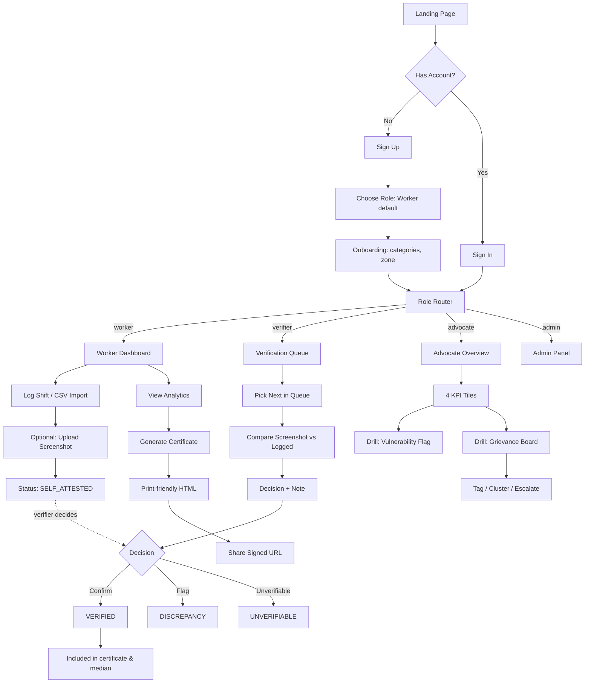
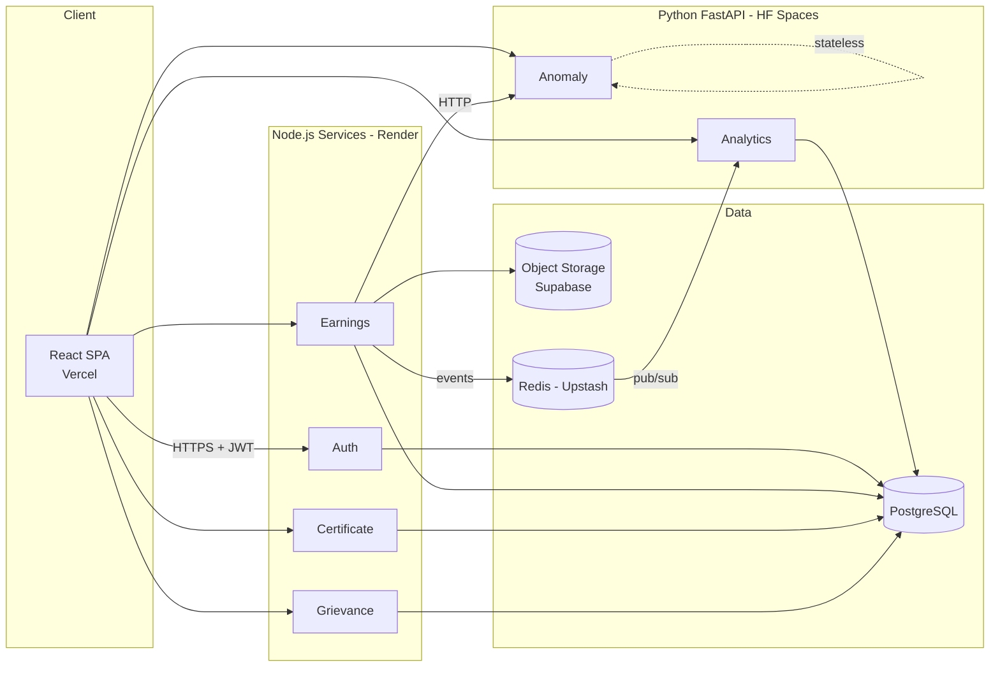
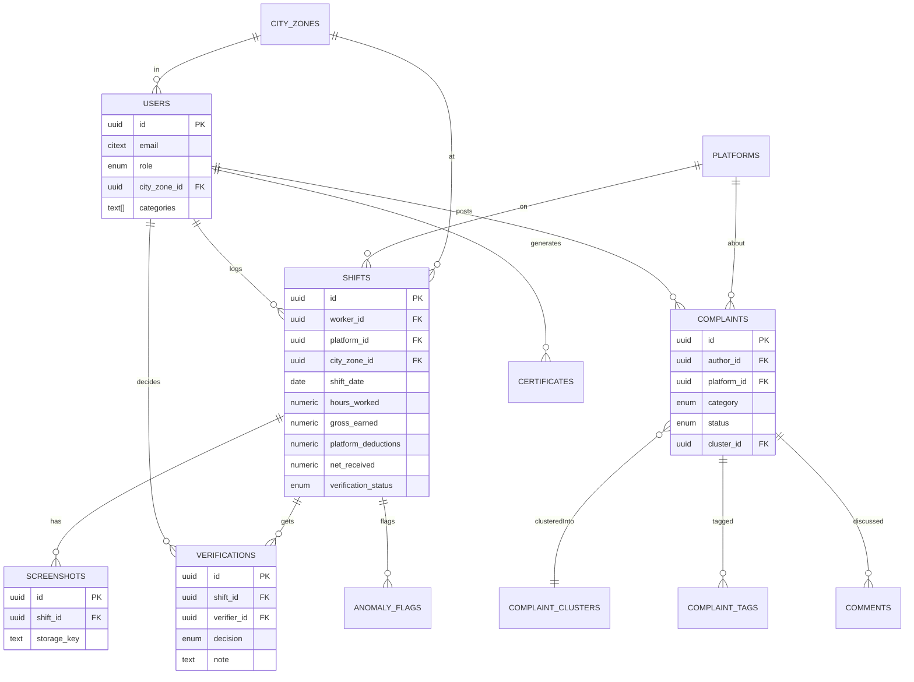

# FairGig — Production Implementation Blueprint

> **Project:** FairGig — Gig Worker Income & Rights Platform  
> **Competition:** SOFTEC 2026 Web Dev Competition, FAST-NU Lahore  
> **Stack:** React (Vite + TS) · Node.js/Express · Python/FastAPI · PostgreSQL  
> **Deployment:** Vercel (frontend) · Render (Node services + DB) · Hugging Face Spaces (FastAPI services)  
> **Target:** Web only

---

## 1. Executive Understanding

### 1.1 Project Title

**FairGig — Gig Worker Income & Rights Platform**

### 1.2 Problem Statement Summary

Millions of gig workers in Pakistan (ride-hailing drivers, food couriers, freelance designers, domestic workers) earn fragmented income across multiple platforms with **no unified record, no payslip, no recourse** when commission rates change silently or accounts are deactivated. They cannot prove income to landlords or banks, cannot verify if platform math is fair, and have no collective channel to surface grievances or share rate intelligence.

FairGig is a platform that:

1. Lets workers **log & verify** earnings across platforms.
2. Surfaces **individual & systemic unfairness** via analytics.
3. Gives labour advocates tools to spot patterns at scale.
4. Produces **shareable, printable income certificates** for real-world use (banks, landlords).
5. Is **honest** about the limits of what it can verify.

### 1.3 Main Business Goal

Establish a trustworthy, worker-first source of truth for gig earnings that (a) gives individual workers financial proof and clarity, and (b) produces aggregate evidence of systemic unfairness that advocates can act on.

### 1.4 Target Users

- Non-tech-savvy gig workers (rider-friendly UX is a hard requirement)
- Labour rights advocates / analysts / NGOs
- Volunteer / trained verifiers reviewing screenshot evidence

### 1.5 Core User Roles

| Role                   | Primary Action                                                                        |
| ---------------------- | ------------------------------------------------------------------------------------- |
| **Worker**             | Log shifts, upload screenshots, view analytics, generate certificate, post complaints |
| **Verifier**           | Review uploaded screenshots, confirm / flag / mark unverifiable                       |
| **Advocate / Analyst** | Monitor aggregate KPIs, tag & cluster complaints, escalate                            |
| **Admin** _(implicit)_ | Manage users/roles, moderate content, seed platforms & zones                          |

### 1.6 Success Criteria

- A worker can log 30 days of earnings in < 5 minutes per week (incl. mobile-friendly flow).
- Screenshot verification round-trip < 48h in practice (SLA configurable).
- City-wide median comparison is computed from **real seeded data**, not constants.
- Anomaly service is **judge-callable directly** with a documented, crafted payload.
- Certificate page renders cleanly in `print` media and as exportable HTML/PDF.
- Aggregate queries **never leak individual worker identity** (k-anonymity ≥ 5 enforced).

### 1.7 Key Technical Constraints (verbatim from doc + user pref)

- **Anomaly service MUST be Python FastAPI.**
- **At least one other backend service MUST also be FastAPI.** → We assign **Analytics** to FastAPI.
- **Grievance service MUST be Node.js.**
- Frontend: **React** (user preference) — no WordPress, no low-code.
- Database: free choice, **must justify** anonymised aggregates. → **PostgreSQL** (user preference; see §11 justification).
- City-median must come from **real aggregated queries on seeded data**.
- Anomaly service exposes a **documented public endpoint** (judges will POST crafted payloads).
- All inter-service API contracts **documented** (Postman collection + table).
- Income certificate **must be print-friendly** (CSS `@media print`).
- No Docker compulsion — each service must run with a **single start command + README**.

### 1.8 Important Assumptions (explicit — items the doc does not resolve)

| #   | Assumption                                                                                      | Why                                                                                |
| --- | ----------------------------------------------------------------------------------------------- | ---------------------------------------------------------------------------------- |
| A1  | **Admin role exists** even though not named.                                                    | Someone must seed platforms, zones, and onboard verifiers.                         |
| A2  | **Screenshots are stored in object storage**, not DB blobs.                                     | Scalability; doc says "upload reference." We use Supabase Storage / S3-compatible. |
| A3  | **PKR (Pakistani Rupee)** is the default currency.                                              | Pakistan-focused problem.                                                          |
| A4  | **Anonymisation threshold k = 5**.                                                              | Medians/aggregates only return when ≥ 5 workers in the cohort.                     |
| A5  | **"Lightweight event mechanism"** between services = Redis Pub/Sub **or** direct HTTP webhooks. | Doc allows both; Pub/Sub is simpler on Render.                                     |
| A6  | **Verification SLA = 72h** default, configurable.                                               | Doc does not specify.                                                              |
| A7  | **CSV schema fixed & documented** with a downloadable template.                                 | Doc says "bulk CSV import" — template avoids parsing chaos.                        |
| A8  | **Community bulletin board = posts within Grievance service** with `visibility=public_anon`.    | Doc treats it as "anonymous bulletin" — same entity family as complaints.          |
| A9  | **"Escalated" complaints** may be published with PII stripped.                                  | Advocates need a public channel for pressure campaigns.                            |
| A10 | **i18n: English + Urdu (RTL-aware)** from day 1.                                                | "Must work for a rider who is not tech-savvy" strongly implies Urdu.               |

### 1.9 Risks & Unclear Areas

| Risk                                                     | Mitigation                                                                                    |
| -------------------------------------------------------- | --------------------------------------------------------------------------------------------- |
| Screenshots may contain PII (phone numbers, full names). | Auto-blur pipeline (optional) + verifier instructions to not leak PII. Access-log every view. |
| Verification is human-slow; worker frustration.          | Show clear status, SLA timer, and allow "self-attested" state marked as such on certificate.  |
| Advocates could de-anonymise small cohorts.              | Enforce k-anonymity at the analytics query layer (reject response if cohort < k).             |
| FastAPI on Hugging Face can cold-start slowly.           | Keep anomaly service stateless; add a `/health` ping hit on frontend load.                    |
| Seeded data could be gamed to skew median.               | Only `verification_status = VERIFIED` shifts enter median queries.                            |
| CSV import with garbage rows.                            | Per-row validation with error report CSV returned to user.                                    |

---

## 2. Requirement Extraction

### 2.1 Functional Requirements (explicit from doc)

**FR-1. Earnings logger** — workers log shifts with: `platform, date, hours_worked, gross_earned, platform_deductions, net_received`.  
**FR-2. Bulk CSV import** for tech-savvy users.  
**FR-3. Screenshot upload** for a shift / period.  
**FR-4. Verification flow** — verifier reviews and sets: `CONFIRMED | DISCREPANCY_FLAGGED | UNVERIFIABLE`.  
**FR-5. Verification status on worker profile.**  
**FR-6. Worker analytics:** weekly/monthly earnings, effective hourly rate, commission tracker, city-wide median comparison (same category).  
**FR-7. Shareable income certificate** — printable HTML covering a worker-selected date range, only verified earnings.  
**FR-8. Grievance board** — workers post (platform, category, description).  
**FR-9. Complaint tagging, clustering** — advocates cluster similar complaints.  
**FR-10. Escalation workflow** — advocates mark `escalated | resolved`.  
**FR-11. Advocate analytics panel:** platform commission trends, income distribution by zone, top complaint categories (weekly), **workers with >20% MoM income drop** (vulnerability flag).  
**FR-12. Anomaly detection service** — accepts earnings history, returns flagged anomalies with plain-language explanations.  
**FR-13. Auth service** — JWT, role management (worker/verifier/advocate), token refresh.  
**FR-14. Inter-service REST APIs** with documented contracts.  
**FR-15. Each service independently runnable** with single start command + README.  
**FR-16. Community bulletin board** (anonymous, moderated) for rate intel, complaints, support.

### 2.2 Non-Functional Requirements

- **Usability:** "must work for a rider who is not tech-savvy" → low-literacy UX, icon-led, Urdu option, big tap targets.
- **Honesty:** UI must clearly distinguish `SELF_ATTESTED` vs `VERIFIED` earnings. Certificate must not present unverified earnings as verified.
- **Observability:** Each service logs structured JSON; a health endpoint (`/health`).
- **Performance:** Worker dashboard p95 < 1.5s; advocate analytics p95 < 3s (aggregations).
- **Reliability:** Each service runnable in isolation (no hard-start coupling).
- **Maintainability:** Feature-based module layout, typed contracts (TS + Pydantic).

### 2.3 Business Requirements

- Be the **worker-trusted** source of income truth in Pakistan.
- Provide evidence base for **labour advocacy** (aggregate commission / deactivation trends).
- Produce **bank/landlord-acceptable** income certificates.
- Be **free-tier deployable** (Vercel + Render + HF Spaces) so NGOs can self-host.

### 2.4 Technical Requirements (explicit + derived)

- React frontend.
- Node.js for **Grievance** (required). Node.js also chosen for Auth, Earnings, Certificate (user's Express preference).
- FastAPI for **Anomaly** (required) and **Analytics** (satisfies "one other FastAPI").
- PostgreSQL (single DB, schema-per-service pattern — see §11).
- File/object storage for screenshots (Supabase Storage recommended; S3-compatible).
- Redis (optional, for caching + lightweight pub/sub events).
- Single-command start per service (`npm run dev` / `uvicorn main:app --reload`) + README per service.
- Postman collection + contract table (committed to repo).

### 2.5 Security Requirements

- JWT access + refresh tokens (rotation on refresh).
- Role-based access control enforced **in every service**, not only at gateway.
- Password hashing: bcrypt/argon2.
- File upload: mime/size checks; store in private bucket with signed URLs.
- Rate limiting on auth + upload endpoints.
- CORS: allow-list of frontend origins.
- Audit logging on verification decisions, role changes, complaint escalations.
- Screenshots accessed via signed, time-limited URLs only.
- PII-minimal aggregates (k-anonymity on analytics).

### 2.6 Performance Requirements

- API p95 latency: auth/reads < 300ms, analytics < 3s.
- CSV import up to 5,000 rows accepted as background job (return `jobId`).
- Anomaly endpoint responds < 2s for 90-day history payloads (statistical, not ML).
- Frontend bundle ≤ 250KB initial JS (gzipped) for mobile rider use.

### 2.7 Scalability Requirements

- Stateless services (all state in Postgres / object store / Redis).
- Read replicas possible later for analytics.
- Schema-per-service → easy to split to separate DBs at v2.
- Analytics uses materialised views for heavy queries.

### 2.8 Compliance & Validation Requirements

- Input validation with Zod (TS) / Pydantic (Python).
- Data minimisation: only collect what's required to prove income.
- Worker has right to export + delete their own data (GDPR-style, even if not legally required in PK — good practice).
- Certificate clearly labels "verified by FairGig verifier" vs "self-reported."
- Screenshots treated as sensitive; retained only while linked to an earnings record the worker keeps.

### 2.9 Admin Requirements _(implicit, A1)_

- Seed platforms (Uber, Careem, Bykea, Foodpanda, inDrive, etc.).
- Seed city zones (districts/towns/sectors).
- Onboard verifiers; promote/demote advocates.
- View audit logs.
- Freeze abusive accounts.

### 2.10 Reporting / Analytics Requirements

- Worker: weekly / monthly rollups, hourly rate, commission % trend.
- Advocate: platform commission trend chart, income distribution by city zone, top complaint categories (week), vulnerability list.
- Certificate: PDF-style HTML with date range totals, only verified shifts.

### 2.11 Explicit vs Implicit Requirements

- **Explicit:** everything in §2.1, §2.4 constraints, §2.10.
- **Implicit:**
  - Admin role & admin panel (A1).
  - i18n English+Urdu (A10).
  - Object storage for screenshots (A2).
  - Background job for CSV import.
  - k-anonymity on aggregates.
  - Audit logging.
  - PII scrubbing on public complaint posts.

---

## 3. Product Scope

### 3.1 In-Scope (MVP — must have to pass judging)

1. Auth (register, login, refresh, roles).
2. Earnings logger (manual + CSV import).
3. Screenshot upload + verification flow with statuses.
4. Worker analytics dashboard (trends, hourly rate, commission tracker, city median).
5. Income certificate (print-friendly HTML).
6. Grievance board (post, list, tag, cluster, escalate).
7. Advocate analytics panel (all 4 KPIs specified).
8. Anomaly FastAPI service with documented payload.
9. Seeded data for platforms, zones, sample workers.
10. Postman collection + contract table.

### 3.2 Out-of-Scope (MVP)

- Mobile native apps.
- Real platform API integrations (no Uber API etc.) — we log manually/CSV only.
- Automated OCR of screenshots (explicit: "honest about what it can and cannot verify").
- Payments / in-app cash flow.
- SMS gateway (use email-only notifications).

### 3.3 Phase 2

- Urdu full translation (MVP has key UI strings only).
- Automated OCR pre-fill (with clear "assisted, not verified" label).
- Verifier reputation / double-verification.
- Public campaigns module.
- Advocate CSV export / PDF export of aggregates.
- Mobile PWA install prompts + offline log.

### 3.4 Nice-to-Have

- Dark mode.
- Push notifications (Web Push).
- In-app voice notes on complaints.
- Platform-specific commission rule templates.

### 3.5 Future Enhancements

- Direct integrations where platforms offer rider APIs.
- ML-based screenshot authenticity scoring.
- Union / collective-bargaining toolkit.
- Multi-country, multi-currency.
- Bank partnership: one-click loan application using certificate.

---

## 4. Complete Feature Breakdown

### Module: Authentication

| #   | Feature              | Purpose                    | Roles    | Priority | Deps | Inputs                                              | Outputs         | Edge cases                     | Validation                                | Error states                     | Success                              |
| --- | -------------------- | -------------------------- | -------- | -------- | ---- | --------------------------------------------------- | --------------- | ------------------------------ | ----------------------------------------- | -------------------------------- | ------------------------------------ |
| A1  | Register             | Create account             | public   | H        | —    | name, email, phone, password, role=worker (default) | JWT pair        | duplicate email, weak password | email regex, password ≥ 10 chars incl num | 409 duplicate, 422 validation    | user created, redirect to onboarding |
| A2  | Login                | Authenticate               | public   | H        | A1   | email, password                                     | JWT pair + user | wrong creds, locked            | rate limit 5/min                          | 401, 429                         | dashboard route by role              |
| A3  | Refresh token        | Keep session               | all auth | H        | A2   | refresh JWT                                         | new access JWT  | expired / revoked              | token signature                           | 401                              | new token silently                   |
| A4  | Logout               | Revoke refresh             | all auth | H        | A2   | refresh JWT                                         | ok              | already revoked                | —                                         | 204 always                       | token blacklisted                    |
| A5  | Role upgrade request | Worker → Verifier/Advocate | auth     | M        | A1   | role, reason                                        | pending request | already requested              | —                                         | 409                              | admin queue                          |
| A6  | Forgot password      | Reset via email            | public   | M        | A1   | email                                               | reset link sent | unknown email (silent ok)      | —                                         | 200 always (enum attack defense) | email sent                           |
| A7  | Change password      | Update creds               | auth     | M        | A2   | old, new                                            | ok              | wrong old                      | strength                                  | 401, 422                         | session invalidated                  |

### Module: User & Profile

| #   | Feature                                                   | Purpose                                                   | Roles    | Priority |
| --- | --------------------------------------------------------- | --------------------------------------------------------- | -------- | -------- |
| U1  | Worker profile                                            | Name, phone, city zone, categories (rider, courier, etc.) | worker   | H        |
| U2  | Verification badge on profile                             | Show count/percentage of verified shifts                  | all      | H        |
| U3  | Verifier profile                                          | Bio, verification count                                   | verifier | M        |
| U4  | Advocate profile                                          | Organization, linked campaigns                            | advocate | M        |
| U5  | Settings: language (en/ur), notifications, delete account | —                                                         | auth     | M        |

### Module: Earnings

| #   | Feature                             | Purpose                          | Roles            | Priority | Key validations                                                     |
| --- | ----------------------------------- | -------------------------------- | ---------------- | -------- | ------------------------------------------------------------------- |
| E1  | Log shift (form)                    | Capture one shift                | worker           | H        | date ≤ today; gross ≥ net; deductions = gross − net (auto-computed) |
| E2  | Edit/delete shift                   | Correct mistakes                 | worker           | H        | cannot edit after `VERIFIED`; must create correction                |
| E3  | Bulk CSV import                     | Upload many shifts               | worker           | H        | row-level validation; returns error CSV                             |
| E4  | CSV template download               | Help users                       | worker           | H        | —                                                                   |
| E5  | Attach screenshot to shift / period | Evidence                         | worker           | H        | max 5 MB, jpg/png/webp                                              |
| E6  | List my shifts (filters)            | Review history                   | worker           | H        | pagination                                                          |
| E7  | Shift detail                        | Full info + verification history | worker, verifier | H        | —                                                                   |

### Module: Verification

| #   | Feature                                  | Purpose                    | Roles    | Priority |
| --- | ---------------------------------------- | -------------------------- | -------- | -------- |
| V1  | Verification queue                       | Screenshots pending        | verifier | H        |
| V2  | Review screenshot                        | Compare with logged values | verifier | H        |
| V3  | Decision (confirm / flag / unverifiable) | State transition           | verifier | H        |
| V4  | Add note / reason                        | Transparency               | verifier | H        |
| V5  | Worker notified                          | UX loop                    | worker   | H        |
| V6  | Audit trail per shift                    | Compliance                 | all      | M        |

### Module: Analytics (Worker)

| #   | Feature                                      | Purpose                 | Priority |
| --- | -------------------------------------------- | ----------------------- | -------- |
| WA1 | Weekly / monthly earnings trend chart        | Trend awareness         | H        |
| WA2 | Effective hourly rate over time              | Fairness insight        | H        |
| WA3 | Platform commission rate tracker             | Detect platform changes | H        |
| WA4 | City-wide median comparison (category, zone) | "Am I earning fairly?"  | H        |
| WA5 | Verification ratio                           | Trust signal            | M        |
| WA6 | Anomaly alerts panel                         | Show flagged items      | H        |

### Module: Certificate

| #   | Feature                                                | Purpose                       | Priority |
| --- | ------------------------------------------------------ | ----------------------------- | -------- |
| C1  | Date range picker                                      | Flexible report               | H        |
| C2  | Preview certificate                                    | Before sharing                | H        |
| C3  | Print / save as PDF (browser print)                    | Delivery                      | H        |
| C4  | Shareable signed URL (time-limited, public read)       | For landlords without account | H        |
| C5  | Certificate includes verification stamp + QR to verify | Trust                         | M        |

### Module: Grievance Board

| #   | Feature                         | Purpose         | Roles           | Priority |
| --- | ------------------------------- | --------------- | --------------- | -------- |
| G1  | Post complaint                  | Voice issue     | worker          | H        |
| G2  | Public/anonymous bulletin posts | Community       | worker          | H        |
| G3  | Tag complaint                   | Categorise      | advocate        | H        |
| G4  | Cluster similar complaints      | Pattern finding | advocate        | H        |
| G5  | Escalate complaint              | Drive action    | advocate        | H        |
| G6  | Resolve complaint               | Close loop      | advocate        | H        |
| G7  | Comment thread                  | Discussion      | all             | M        |
| G8  | Moderate (remove abuse)         | Safety          | advocate, admin | H        |
| G9  | Report post                     | Safety          | worker          | M        |

### Module: Advocate Analytics

| #   | Feature                                       | Purpose          | Priority |
| --- | --------------------------------------------- | ---------------- | -------- |
| AA1 | Platform commission trend (line)              | Systemic pattern | H        |
| AA2 | Income distribution by city zone (box/violin) | Inequality view  | H        |
| AA3 | Top complaint categories this week            | Attention focus  | H        |
| AA4 | Vulnerability flag list (MoM drop >20%)       | Intervention     | H        |
| AA5 | Export aggregates (CSV, phase 2)              | Reporting        | M        |

### Module: Anomaly Detection

| #   | Feature                                  | Purpose               | Priority |
| --- | ---------------------------------------- | --------------------- | -------- |
| AN1 | `POST /detect` — accept earnings payload | Core requirement      | H        |
| AN2 | Z-score on deductions and hourly rate    | Detect outliers       | H        |
| AN3 | MoM drop detection                       | Catch income collapse | H        |
| AN4 | Plain-language explanation               | Worker comprehension  | H        |
| AN5 | Health endpoint                          | Ops                   | H        |
| AN6 | OpenAPI docs at `/docs`                  | Judges' direct call   | H        |

### Module: Admin Panel (implicit)

| #   | Feature                       | Priority |
| --- | ----------------------------- | -------- |
| AD1 | Seed/manage platforms         | H        |
| AD2 | Seed/manage city zones        | H        |
| AD3 | Approve role upgrade requests | H        |
| AD4 | User list + freeze            | M        |
| AD5 | Audit log viewer              | M        |

### Module: Notifications (in-app + email)

| #   | Trigger                                         | Priority |
| --- | ----------------------------------------------- | -------- |
| N1  | Verification decision                           | H        |
| N2  | Anomaly detected                                | H        |
| N3  | Complaint tagged/escalated/resolved             | M        |
| N4  | Role upgrade approved                           | M        |
| N5  | Weekly digest (worker: your earnings this week) | L        |

### Module: File Uploads

| #   | Feature                   | Priority |
| --- | ------------------------- | -------- |
| F1  | Pre-signed upload URL     | H        |
| F2  | Mime + size validation    | H        |
| F3  | Virus scan hook (phase 2) | L        |
| F4  | Signed read URL with TTL  | H        |

### Module: Audit Logs

| #   | Feature                           | Priority |
| --- | --------------------------------- | -------- |
| AU1 | Auto-log verification decisions   | H        |
| AU2 | Auto-log role changes             | H        |
| AU3 | Auto-log complaint status changes | M        |

### Module: Search & Filter

- Shifts by date range, platform, status.
- Complaints by platform, category, tag, status.
- Verification queue by age, platform.

---

## 5. User Roles and Permissions

### 5.1 Roles

**Worker**

- Permissions: create/read/update/delete own shifts (pre-verification), upload screenshots, view own analytics, generate own certificate, post complaints, comment, request role upgrade.
- Restricted: cannot verify, cannot see other workers' shifts, cannot access advocate analytics except anonymised public views.
- Data access: **own** shifts only; aggregate views anonymised.

**Verifier**

- Permissions: read screenshots in their assigned queue, create verification decisions, add notes, view the shift they're verifying.
- Restricted: cannot edit shift numeric values, cannot access advocate analytics, cannot see worker PII beyond display name + city zone.
- Data access: read shift + screenshot within their queue only; no worker contact details.

**Advocate / Analyst**

- Permissions: read aggregate analytics, tag & cluster complaints, escalate, resolve, moderate public posts, view vulnerability list (anonymised IDs), view complaint detail (author displayed as anon handle unless they waived anonymity).
- Restricted: cannot see individual worker earnings numbers (only aggregates); cannot reassign verifications.
- Data access: aggregates (k ≥ 5), complaints (anon), vulnerability IDs (internal anonymised).

**Admin (implicit)**

- Permissions: manage platforms/zones, approve role upgrades, freeze users, view audit logs, seed data, system settings.
- Restricted: cannot read raw screenshots unless investigating abuse (logged).
- Data access: everything, with every read auditable.

### 5.2 Role-Permission Matrix

| Capability                     | Worker                  | Verifier    | Advocate       | Admin              |
| ------------------------------ | ----------------------- | ----------- | -------------- | ------------------ |
| Register self                  | ✅                      | — (invited) | — (invited)    | —                  |
| Log shift                      | ✅ own                  | ❌          | ❌             | ❌                 |
| Upload screenshot              | ✅ own                  | ❌          | ❌             | ❌                 |
| Verify screenshot              | ❌                      | ✅          | ❌             | ❌                 |
| View own earnings              | ✅                      | n/a         | n/a            | ✅ (read, audited) |
| View aggregate analytics       | partial (own vs median) | ❌          | ✅ full        | ✅                 |
| Generate own certificate       | ✅                      | ❌          | ❌             | ✅ (any, audited)  |
| Post complaint                 | ✅                      | ❌          | ❌             | ❌                 |
| Tag/cluster/escalate complaint | ❌                      | ❌          | ✅             | ✅                 |
| Moderate posts                 | ❌                      | ❌          | ✅             | ✅                 |
| Seed platforms/zones           | ❌                      | ❌          | ❌             | ✅                 |
| Freeze user                    | ❌                      | ❌          | ❌             | ✅                 |
| View audit logs                | ❌                      | ❌          | ❌             | ✅                 |
| Call anomaly API (own data)    | ✅                      | ❌          | aggregate only | ✅                 |

### 5.3 Role-Based Workflows (summary)

- **Worker:** onboard → log → (optional) upload screenshot → wait for verification → view analytics → generate certificate → post complaint if issue.
- **Verifier:** open queue → pick next → compare screenshot to logged values → decide → add note → submit.
- **Advocate:** open dashboard → scan 4 KPI tiles → drill into vulnerability list → drill into top complaints → tag/cluster → escalate.
- **Admin:** seed → approve role upgrades → monitor audit logs → respond to abuse reports.

---

## 6. Platform-Wide User Flow

### 6.1 Step-by-Step Flow

1. **Entry points:** landing page (public) → Sign Up / Sign In / Learn More / Sample Certificate (public demo).
2. **Onboarding (worker):** choose role → phone+OTP (phase 2) / email+password → select categories (rider, courier, etc.) → select city zone → short "how verification works" explainer.
3. **Authentication:** JWT access (15m) + refresh (7d). Refresh rotates; old refresh is blacklisted.
4. **Role-based navigation:** after login, frontend reads role claim and routes:
   - worker → `/worker/dashboard`
   - verifier → `/verify/queue`
   - advocate → `/advocate/overview`
   - admin → `/admin/overview`
5. **Worker main task flows:** Log shift OR Import CSV → optional screenshot → view status → view analytics → if 30+ verified days, generate certificate.
6. **Verifier main flow:** Queue → Shift detail with screenshot → Decide → Submit → Audit log entry.
7. **Advocate flow:** Overview → KPI drilldowns → Grievance board clustering → Escalate selection.
8. **Backend processing flow:** UI → Service (with JWT) → RBAC check → validator → repository → DB. Events (e.g., `shift.verified`) → optional pub/sub → downstream consumers (notification service).
9. **System response flow:** service returns JSON (envelope: `{data, meta, error}`), frontend TanStack Query caches, optimistic UI where safe.
10. **Notifications:** in-app bell + email. Triggered from event bus or direct service call.
11. **Error recovery:** global error boundary in React; toast on network errors; auto-retry on 502/503; forced re-auth on 401 after refresh fails.
12. **Logout / session:** revoke refresh token, clear local state, redirect to landing.

### 6.2 Mermaid Flow



---

## 7. Page & Screen Planning

### 7.1 Public Pages

| Page                            | Purpose                           | Roles  | Main sections                                         | Key components                         | API deps                       | States                    |
| ------------------------------- | --------------------------------- | ------ | ----------------------------------------------------- | -------------------------------------- | ------------------------------ | ------------------------- |
| `/` Landing                     | Explain product, CTA              | public | hero, how-it-works, sample certificate, for-advocates | Hero, FeatureCard, TestimonialCarousel | —                              | default                   |
| `/auth/sign-in`                 | Login                             | public | form, forgot pw link                                  | Form (RHF+Zod)                         | `POST /auth/login`             | loading / error           |
| `/auth/sign-up`                 | Register                          | public | form, role info                                       | Form                                   | `POST /auth/register`          | loading / success / error |
| `/auth/forgot`                  | Request reset                     | public | email input                                           | Form                                   | `POST /auth/forgot`            | sent                      |
| `/auth/reset/:token`            | Set new pw                        | public | pw form                                               | Form                                   | `POST /auth/reset`             | done                      |
| `/certificate/public/:signedId` | Public view of shared certificate | public | full certificate                                      | CertificateView                        | `GET /certificates/public/:id` | expired / ok              |
| `/about`, `/privacy`, `/terms`  | Legal / info                      | public | static                                                | —                                      | —                              | —                         |

### 7.2 Worker Pages (`/worker/*`)

| Page                  | Purpose               | Sections                               | Components                                               | API                                                         |
| --------------------- | --------------------- | -------------------------------------- | -------------------------------------------------------- | ----------------------------------------------------------- |
| `/worker/dashboard`   | Home                  | KPI tiles, recent shifts, alerts       | KpiTile, ShiftTable, AnomalyFeed                         | `GET /analytics/worker/summary`, `GET /anomaly/my-alerts`   |
| `/worker/shifts`      | List shifts           | filters, table, pagination             | ShiftTable, FiltersBar                                   | `GET /earnings/shifts?...`                                  |
| `/worker/shifts/new`  | Log a shift           | form                                   | ShiftForm                                                | `POST /earnings/shifts`                                     |
| `/worker/shifts/:id`  | Shift detail          | form (edit), screenshot, history       | ShiftForm, ScreenshotViewer, HistoryTimeline             | `GET/PUT /earnings/shifts/:id`                              |
| `/worker/import`      | CSV import            | upload, preview, error report          | CsvDropzone, ValidationReport                            | `POST /earnings/import`                                     |
| `/worker/analytics`   | Deep analytics        | trend, hourly rate, commission, median | EarningsTrendChart, CommissionTracker, MedianCompareCard | `GET /analytics/worker/*`                                   |
| `/worker/certificate` | Build & share         | date range, preview, print, share URL  | DateRangePicker, CertificatePreview                      | `GET /certificate/build?from&to`, `POST /certificate/share` |
| `/worker/grievances`  | My complaints + board | tabs: mine \| board                    | ComplaintCard, ComposeDialog                             | `GET /grievance/mine`, `GET /grievance/board`               |
| `/worker/settings`    | Profile & prefs       | profile, language, delete              | SettingsSections                                         | `PUT /users/me`, `DELETE /users/me`                         |

### 7.3 Verifier Pages (`/verify/*`)

| Page               | Purpose                                                         |
| ------------------ | --------------------------------------------------------------- |
| `/verify/queue`    | Paginated list of pending screenshots with age, platform filter |
| `/verify/:shiftId` | Side-by-side: screenshot viewer ↔ logged values ↔ decision form |
| `/verify/history`  | My past decisions                                               |

### 7.4 Advocate Pages (`/advocate/*`)

| Page                       | Purpose                                                                                      |
| -------------------------- | -------------------------------------------------------------------------------------------- |
| `/advocate/overview`       | 4 KPI tiles (commission trend, income by zone, top complaint categories, vulnerability list) |
| `/advocate/commissions`    | Drilldown: commission trend per platform                                                     |
| `/advocate/zones`          | Drilldown: income distribution by zone                                                       |
| `/advocate/complaints`     | Grievance board mgmt (tag, cluster, escalate)                                                |
| `/advocate/complaints/:id` | Complaint detail + cluster linker                                                            |
| `/advocate/vulnerability`  | List + trend for workers with >20% MoM drop (anon IDs)                                       |

### 7.5 Admin Pages (`/admin/*`)

| Page               | Purpose                                |
| ------------------ | -------------------------------------- |
| `/admin/overview`  | Counts, recent audit events            |
| `/admin/platforms` | CRUD platforms                         |
| `/admin/zones`     | CRUD city zones                        |
| `/admin/users`     | Search, freeze, role-upgrade approvals |
| `/admin/audit`     | Audit log viewer with filters          |
| `/admin/seed`      | One-click seed (dev/demo only)         |

### 7.6 Navigation Structure

**Top bar (all authed):** logo · role-aware nav · language toggle · notification bell · profile menu.  
**Sidebar (role-aware):**

- Worker: Dashboard, Shifts, Import, Analytics, Certificate, Grievances, Settings.
- Verifier: Queue, History, Settings.
- Advocate: Overview, Commissions, Zones, Complaints, Vulnerability, Settings.
- Admin: Overview, Platforms, Zones, Users, Audit, Seed.

**Breadcrumbs:** on detail pages (`Shifts / 2026-04-17 / Edit`).

### 7.7 Universal Page States

Every list page must implement: **loading** (skeleton), **empty** (illustration + CTA), **error** (retry), **filtered-empty** ("clear filters"), **permission-denied** (403), **offline** (banner).

---

## 8. Production-Grade Folder Structure

### 8.1 Monorepo Root

```
fairgig/
├── apps/
│   ├── web/                      # React + Vite + TS frontend
│   ├── auth-service/             # Node/Express
│   ├── earnings-service/         # Node/Express
│   ├── certificate-service/      # Node/Express
│   ├── grievance-service/        # Node/Express (REQUIRED)
│   ├── anomaly-service/          # Python FastAPI (REQUIRED)
│   └── analytics-service/        # Python FastAPI (satisfies +1 FastAPI)
├── packages/
│   ├── shared-types/             # TypeScript types shared between web & Node services
│   ├── shared-config/            # eslint, tsconfig, prettier bases
│   └── api-contracts/            # OpenAPI/JSON schema per service
├── infra/
│   ├── postman/                  # Postman collection (judges' deliverable)
│   ├── db/
│   │   ├── migrations/           # Raw SQL or Prisma migrations
│   │   └── seed/                 # seed.ts/.py
│   ├── scripts/                  # start-all.sh, health-check.sh
│   └── env-templates/            # .env.example per service
├── docs/
│   ├── ARCHITECTURE.md
│   ├── API_CONTRACTS.md          # contracts table (required)
│   ├── RUNBOOK.md
│   ├── DB_SCHEMA.md
│   └── ANOMALY_API.md            # so judges can call it
├── .github/workflows/            # CI
├── package.json                  # pnpm workspaces root
├── pnpm-workspace.yaml
└── README.md                     # quickstart per service
```

> **Why monorepo?** Shared types between frontend and Node backends, single CI, and simpler onboarding. Each app still builds & deploys independently.

### 8.2 Frontend — `apps/web/`

```
apps/web/
├── public/
├── src/
│   ├── main.tsx
│   ├── App.tsx
│   ├── router/
│   │   ├── index.tsx             # route tree
│   │   ├── ProtectedRoute.tsx    # auth guard
│   │   └── RoleRoute.tsx         # role guard
│   ├── features/                 # FEATURE-BASED modules
│   │   ├── auth/
│   │   │   ├── pages/
│   │   │   ├── components/
│   │   │   ├── hooks/
│   │   │   ├── api.ts
│   │   │   └── schemas.ts        # zod
│   │   ├── shifts/
│   │   ├── verification/
│   │   ├── analytics/
│   │   ├── certificate/
│   │   ├── grievances/
│   │   ├── advocate/
│   │   └── admin/
│   ├── components/               # shared UI (Button, Card, Table...)
│   │   └── ui/                   # shadcn-like primitives
│   ├── layouts/
│   │   ├── PublicLayout.tsx
│   │   ├── AppLayout.tsx         # sidebar + topbar
│   │   └── PrintLayout.tsx       # certificate
│   ├── hooks/                    # cross-cutting (useAuth, useToast)
│   ├── lib/
│   │   ├── apiClient.ts          # axios instance + interceptors
│   │   ├── queryClient.ts        # TanStack Query
│   │   ├── auth.ts               # token store
│   │   ├── i18n.ts
│   │   └── formatters.ts
│   ├── stores/                   # zustand (auth, ui)
│   ├── types/                    # app-level types (re-export from shared)
│   ├── styles/
│   │   ├── globals.css           # tailwind
│   │   └── print.css             # certificate print styles
│   └── assets/
├── tests/
│   ├── unit/
│   ├── component/
│   └── e2e/                      # Playwright
├── .env.example
├── index.html
├── vite.config.ts
├── tsconfig.json
└── package.json
```

**Why this layout?** Feature-based folders keep related concerns together; a thin shared `components/ui` houses primitives; `router/` centralises guards; `lib/` is the single place for cross-cutting infra (api client, query client).

### 8.3 Node Service Template — `apps/<service>/` (Express + TS)

```
apps/earnings-service/
├── src/
│   ├── index.ts                  # bootstrap
│   ├── app.ts                    # express app (easier to test)
│   ├── config/
│   │   └── env.ts                # zod-validated env
│   ├── routes/
│   │   └── shifts.routes.ts
│   ├── controllers/
│   │   └── shifts.controller.ts
│   ├── services/
│   │   └── shifts.service.ts     # business logic
│   ├── repositories/
│   │   └── shifts.repo.ts        # Prisma/kysely queries
│   ├── validators/
│   │   └── shifts.schema.ts      # zod
│   ├── middleware/
│   │   ├── auth.ts               # JWT verify
│   │   ├── rbac.ts
│   │   ├── errorHandler.ts
│   │   ├── requestId.ts
│   │   └── rateLimit.ts
│   ├── jobs/                     # background (bull/bullmq)
│   │   └── csvImport.job.ts
│   ├── events/                   # publish/subscribe
│   │   ├── publisher.ts
│   │   └── handlers/
│   ├── integrations/
│   │   ├── storage.ts            # supabase / s3
│   │   └── anomalyClient.ts      # typed client to anomaly service
│   ├── utils/
│   │   ├── logger.ts             # pino
│   │   └── errors.ts             # AppError class
│   └── types/
├── prisma/
│   ├── schema.prisma
│   └── migrations/
├── tests/
│   ├── unit/
│   └── integration/              # supertest
├── .env.example
├── tsconfig.json
├── package.json
└── README.md                     # single start command (REQUIRED)
```

### 8.4 FastAPI Service Template — `apps/anomaly-service/`

```
apps/anomaly-service/
├── app/
│   ├── main.py                   # FastAPI instance
│   ├── config.py                 # pydantic-settings
│   ├── api/
│   │   ├── routes/
│   │   │   ├── detect.py
│   │   │   └── health.py
│   │   └── deps.py               # dependency injection
│   ├── schemas/                  # pydantic models (request/response)
│   │   └── detect.py
│   ├── services/
│   │   └── detector.py           # statistical logic
│   ├── core/
│   │   ├── stats.py              # zscore, MAD, MoM
│   │   └── explain.py            # human-readable sentences
│   ├── middleware/
│   │   ├── auth.py               # JWT verify (shared secret with Node)
│   │   └── logging.py
│   └── utils/
├── tests/
├── requirements.txt
├── .env.example
├── pyproject.toml
└── README.md
```

### 8.5 Analytics Service (FastAPI) — same template as anomaly, plus:

```
app/
├── repositories/                 # SQLAlchemy / asyncpg
├── queries/                      # parameterised SQL aggregations
└── services/
    └── kpi.py                    # vulnerability flag, commission trend, etc.
```

### 8.6 Shared / Packages

```
packages/shared-types/src/
├── auth.ts
├── user.ts
├── shift.ts
├── verification.ts
├── complaint.ts
└── analytics.ts

packages/api-contracts/
├── auth.openapi.yaml
├── earnings.openapi.yaml
├── certificate.openapi.yaml
├── grievance.openapi.yaml
├── anomaly.openapi.yaml
└── analytics.openapi.yaml
```

### 8.7 Infra / DevOps

```
infra/
├── postman/FairGig.postman_collection.json   # REQUIRED deliverable
├── db/
│   ├── migrations/               # single source of truth for schema
│   └── seed/
│       ├── platforms.sql
│       ├── zones.sql
│       └── synthetic_workers_and_shifts.ts
├── scripts/
│   ├── dev-all.sh                # boots every service with one command (local)
│   └── health.sh
└── env-templates/*.env.example
```

### 8.8 Testing Layout

Every service has `tests/unit/` and `tests/integration/`. Frontend has `unit/`, `component/`, and top-level `tests/e2e/` (Playwright) that spans the full app.

---

## 9. Libraries & Packages

### 9.1 Frontend (`apps/web`)

| Package                                      | Purpose                       | Why it fits                                          | Essential?  |
| -------------------------------------------- | ----------------------------- | ---------------------------------------------------- | ----------- |
| `react`, `react-dom`                         | UI runtime                    | stack requirement                                    | ✅          |
| `vite`                                       | Bundler                       | fast dev, tiny prod bundles → matches rider use-case | ✅          |
| `typescript`                                 | Types                         | contract safety with Node services                   | ✅          |
| `react-router-dom` v6                        | Routing                       | needed for protected/role routes                     | ✅          |
| `@tanstack/react-query`                      | Server-state                  | caching, retries, offline — great for analytics      | ✅          |
| `axios`                                      | HTTP                          | interceptors for JWT refresh                         | ✅          |
| `zustand`                                    | Client state                  | auth/UI store, simpler than Redux                    | ✅          |
| `react-hook-form` + `@hookform/resolvers`    | Forms                         | perf + DX                                            | ✅          |
| `zod`                                        | Schemas                       | shared with backend contracts                        | ✅          |
| `tailwindcss` + `tailwindcss-animate`        | Styling                       | fast, small CSS                                      | ✅          |
| `shadcn/ui` (vendored) + `@radix-ui/react-*` | Accessible primitives         | a11y matters for low-literacy users                  | ✅          |
| `lucide-react`                               | Icons                         | icon-led UX                                          | ✅          |
| `recharts`                                   | Charts                        | trend, commission, zone viz                          | ✅          |
| `date-fns`                                   | Dates                         | ranges on certificate                                | ✅          |
| `i18next` + `react-i18next`                  | i18n                          | English + Urdu                                       | ✅          |
| `papaparse`                                  | CSV parse client-side preview | import flow                                          | ✅          |
| `@tanstack/react-table`                      | Tables                        | verification queue, shifts                           | ✅          |
| `sonner`                                     | Toasts                        | a11y-friendly                                        | ✅          |
| `vitest`, `@testing-library/react`           | Unit/component tests          | —                                                    | ✅          |
| `@playwright/test`                           | E2E                           | critical flows                                       | ✅          |
| `msw`                                        | API mocking in tests          | —                                                    | ⚪ optional |

### 9.2 Node services (Express + TS)

| Package                                   | Purpose                                 | Essential?                |
| ----------------------------------------- | --------------------------------------- | ------------------------- |
| `express`                                 | HTTP server                             | ✅                        |
| `zod`                                     | request validation                      | ✅                        |
| `prisma` + `@prisma/client`               | ORM for Postgres                        | ✅                        |
| `jsonwebtoken`                            | JWT signing/verify                      | ✅ (auth service primary) |
| `bcrypt`                                  | password hashing                        | ✅ auth                   |
| `cors`                                    | CORS headers                            | ✅                        |
| `helmet`                                  | secure headers                          | ✅                        |
| `express-rate-limit` + `rate-limit-redis` | rate limiting                           | ✅                        |
| `pino`, `pino-http`                       | structured logs                         | ✅                        |
| `cookie-parser`                           | refresh token cookie (httpOnly)         | ✅ auth                   |
| `multer`                                  | multipart uploads (earnings screenshot) | ✅ earnings               |
| `papaparse` or `csv-parse`                | CSV import                              | ✅ earnings               |
| `bullmq` + `ioredis`                      | background jobs (CSV import)            | ✅                        |
| `handlebars`                              | certificate HTML templating             | ✅ certificate            |
| `puppeteer`                               | _(phase 2)_ server-side PDF rendering   | ⚪                        |
| `dotenv`                                  | env loader                              | ✅                        |
| `uuid`                                    | ids                                     | ✅                        |
| `supertest`, `vitest` / `jest`            | tests                                   | ✅                        |
| `eslint`, `prettier`                      | lint/format                             | ✅                        |

### 9.3 Python / FastAPI services

| Package                             | Purpose                                   | Essential?   |
| ----------------------------------- | ----------------------------------------- | ------------ |
| `fastapi`                           | web framework                             | ✅           |
| `uvicorn[standard]`                 | ASGI server                               | ✅           |
| `pydantic`, `pydantic-settings`     | schemas + env                             | ✅           |
| `numpy`, `pandas`                   | stats / aggregations                      | ✅           |
| `scipy`                             | z-score, MAD                              | ✅ anomaly   |
| `sqlalchemy` 2.x + `asyncpg`        | DB access (analytics)                     | ✅ analytics |
| `python-jose[cryptography]`         | JWT verify (shared secret with Node auth) | ✅           |
| `httpx`                             | inter-service calls                       | ✅           |
| `structlog`                         | structured logs                           | ✅           |
| `python-multipart`                  | if file intake                            | ⚪           |
| `pytest`, `pytest-asyncio`, `httpx` | tests                                     | ✅           |
| `ruff`, `black`, `mypy`             | lint/format/types                         | ✅           |

### 9.4 Auth / Security

- `argon2-cffi` or `bcrypt` (pick one; bcrypt chosen for Node ecosystem parity)
- `jsonwebtoken` (Node) + `python-jose` (Python) — same HS256/RS256 key
- `helmet`, `express-rate-limit`, `cors`

### 9.5 DB / ORM

- **Prisma** for all Node services (great DX, migrations).
- **SQLAlchemy 2 async** for analytics (fine control over aggregate SQL).
- Anomaly service is **stateless** (does not hit DB); receives payload in request.

### 9.6 File/Media

- `@supabase/supabase-js` (signed URLs) — or S3 SDK if we swap provider.

### 9.7 Logging / Monitoring

- `pino` (Node), `structlog` (Python).
- `sentry` (@sentry/node, sentry-sdk) — optional but recommended.

### 9.8 Testing

- Node: `vitest` + `supertest`.
- Python: `pytest` + `httpx`.
- E2E: `playwright`.

### 9.9 DevOps

- `pnpm` workspaces.
- `husky` + `lint-staged` for pre-commit.
- GitHub Actions for CI.
- Render + Vercel + HF Spaces for deploy.

### 9.10 Docs / Analytics

- Service OpenAPI `/docs` out of box for FastAPI; use `swagger-ui-express` for Node services.
- Plausible or umami for product analytics (phase 2).

### 9.11 Notifications

- `nodemailer` (email), Resend/Postmark API (prod).
- Web Push (phase 2).

---

## 10. System Architecture

### 10.1 Overview

FairGig is composed of **one React SPA** and **six backend services** sharing a single PostgreSQL instance using **schema-per-service** isolation. Services communicate via documented REST; an optional Redis Pub/Sub is used for async events (`shift.verified`, `complaint.escalated`). Screenshots live in object storage (Supabase Storage / S3) and are served via time-limited signed URLs.

### 10.2 Frontend Architecture

- Vite + React + TS SPA hosted on Vercel.
- Code-split by route (dynamic `import()`).
- Auth via httpOnly refresh cookie + in-memory access token.
- TanStack Query for all server state; Zustand for auth + UI slice only.
- Feature-based folders (see §8.2).

### 10.3 Backend Architecture (per-service)

Each service follows **Controller → Service → Repository** and is deployable alone:

```
HTTP → middleware (requestId, logger, cors, helmet, rateLimit, auth, rbac)
     → validator (zod / pydantic)
     → controller → service (business)
     → repository (Prisma / SQLAlchemy)
     → DB / storage / other service via typed client
     → response envelope
```

### 10.4 Service Assignments

| Service     | Runtime      | Path prefix    | Core reason                                     |
| ----------- | ------------ | -------------- | ----------------------------------------------- |
| Auth        | Node/Express | `/auth`        | user preference; JWT tooling mature             |
| Earnings    | Node/Express | `/earnings`    | multipart uploads, CSV, Prisma                  |
| Certificate | Node/Express | `/certificate` | Handlebars HTML render                          |
| Grievance   | Node/Express | `/grievance`   | **required Node.js**                            |
| Anomaly     | FastAPI      | `/anomaly`     | **required FastAPI**, stats with scipy          |
| Analytics   | FastAPI      | `/analytics`   | **satisfies +1 FastAPI**; pandas excels at KPIs |

### 10.5 Database Architecture

- Single Postgres instance with schemas: `auth`, `earnings`, `grievance`, `analytics_views`, `audit`.
- Cross-schema reads allowed only for **Analytics** (read-only role).
- Materialised views in `analytics_views` for expensive aggregations; refreshed on a schedule or on event.

### 10.6 API Architecture

- REST, JSON only, versioned under `/v1`.
- Envelope: `{ "data": ..., "meta": {...}, "error": null }` (error populated on failure).
- OpenAPI per service; committed to `packages/api-contracts/`.
- Auth via `Authorization: Bearer <access>`; services verify shared JWT secret.

### 10.7 Auth Architecture

- **Auth service** issues access (15m) + refresh (7d, rotated).
- JWT HS256 signed with `JWT_SECRET` shared between all services (env var).
- Each service verifies JWT in its own middleware — no gateway dependency.
- Refresh token stored as **httpOnly, Secure, SameSite=Strict** cookie; access token in memory.
- Role encoded in token claims; RBAC check per route.

### 10.8 File / Media Storage

- Supabase Storage bucket `fairgig-screenshots` (private).
- Upload flow: client → `POST /earnings/screenshots/presign` → signed PUT URL → client uploads directly to storage → confirms with earnings service.
- Read flow: service returns short-lived signed URL (TTL 5 min) on shift detail for verifier/owner only.

### 10.9 Third-Party Integrations (MVP)

| Integration                                   | Purpose                                   |
| --------------------------------------------- | ----------------------------------------- |
| Supabase (Postgres + Storage + Auth optional) | DB + file store; Render DB as alternative |
| Resend / Postmark                             | transactional email                       |
| Sentry                                        | errors (optional)                         |

### 10.10 Deployment Architecture

| Piece                                               | Host                                                               |
| --------------------------------------------------- | ------------------------------------------------------------------ |
| Frontend `apps/web`                                 | Vercel (prod + preview per PR)                                     |
| Node services (auth/earnings/certificate/grievance) | Render (web services, free/starter)                                |
| FastAPI services (anomaly, analytics)               | Hugging Face Spaces (Docker SDK) **or** Render                     |
| PostgreSQL                                          | Render Postgres **or** Supabase (recommended — also gives storage) |
| Redis (optional)                                    | Upstash free tier                                                  |

### 10.11 Caching Strategy

- HTTP caching for static chart dictionaries (platforms, zones) with `Cache-Control: max-age=300`.
- Server-side cache in Redis for advocate KPIs (TTL 60s).
- TanStack Query handles client-side cache + stale-while-revalidate.

### 10.12 Background Jobs / Queues

- BullMQ (Redis) in earnings-service for **CSV import**.
- Cron via Render Scheduled Job or `node-cron` for nightly **materialised view refresh** and **vulnerability flag computation**.

### 10.13 Observability

- Logs: JSON to stdout (pino / structlog) → Render/HF Spaces native log viewer.
- Metrics: `/health` on every service.
- Errors: Sentry DSN per service (optional).
- Audit: `audit.events` table append-only.

### 10.14 High-Level Architecture (Mermaid)



### 10.15 Data Flow Example — "Worker logs a shift and sees anomaly alert"

1. SPA `POST /earnings/v1/shifts` with JWT.
2. Earnings service validates (zod), writes `earnings.shifts`, publishes `shift.created`.
3. Earnings service asynchronously calls `POST /anomaly/v1/detect` with last 90 days.
4. Anomaly service runs z-score/MoM and returns anomalies JSON.
5. Earnings service persists `anomaly_flags` row and emits `anomaly.created`.
6. Notification service (or email util) sends in-app notification.
7. SPA refetches via TanStack Query invalidation, alert shows on dashboard.

---

## 11. Database Design

### 11.1 Database Choice Justification (required by doc)

**PostgreSQL** because:

- Strong support for **analytical aggregates** (window fns, `percentile_cont`, materialised views) — needed for city medians and MoM drops.
- **Row-level security** & grantable schemas can enforce per-service isolation.
- **Constraints + transactions** protect financial integrity (`gross = net + deductions`).
- **k-anonymity guardrails** implementable via views that reject cohorts with `count(distinct worker) < 5`.
- Free-tier hosting on Render / Supabase / Neon.
- Mature ecosystem for Prisma + SQLAlchemy.

### 11.2 Schemas

- `auth.*` — users, sessions, role_requests
- `earnings.*` — platforms, city_zones, shifts, screenshots, verifications, anomaly_flags, certificates
- `grievance.*` — complaints, complaint_tags, complaint_clusters, comments, reports
- `audit.events` — append-only log
- `analytics_views.*` — materialised views only, read-only to advocate users

### 11.3 Entities

#### auth.users

| column        | type                                                                   | notes                                   |
| ------------- | ---------------------------------------------------------------------- | --------------------------------------- |
| id            | uuid PK                                                                |                                         |
| email         | citext UNIQUE NOT NULL                                                 |                                         |
| phone         | text                                                                   | nullable; E.164                         |
| password_hash | text NOT NULL                                                          | bcrypt                                  |
| name          | text NOT NULL                                                          |                                         |
| role          | enum('worker','verifier','advocate','admin') NOT NULL DEFAULT 'worker' |                                         |
| language      | enum('en','ur') DEFAULT 'en'                                           |                                         |
| status        | enum('active','frozen','deleted') DEFAULT 'active'                     | soft delete                             |
| city_zone_id  | uuid FK                                                                | for workers                             |
| categories    | text[]                                                                 | e.g. `['ride_hailing','food_delivery']` |
| created_at    | timestamptz default now()                                              |                                         |
| updated_at    | timestamptz                                                            |                                         |
| deleted_at    | timestamptz                                                            |                                         |

- **Indexes:** `idx_users_role`, `idx_users_zone`, unique on `email`.

#### auth.refresh_tokens

| column      | type        |
| ----------- | ----------- |
| id          | uuid PK     |
| user_id     | uuid FK     |
| token_hash  | text        |
| expires_at  | timestamptz |
| revoked_at  | timestamptz |
| replaced_by | uuid        |
| user_agent  | text        |
| ip          | inet        |

#### auth.role_requests

| id | user_id | requested_role | reason | status('pending','approved','rejected') | decided_by | decided_at | created_at |

#### earnings.platforms

| id | name (UNIQUE) | slug | category | active | created_at |

#### earnings.city_zones

| id | name | city | lat | lng | active |

#### earnings.shifts

| column                             | type                                                                                                           | notes                                  |
| ---------------------------------- | -------------------------------------------------------------------------------------------------------------- | -------------------------------------- |
| id                                 | uuid PK                                                                                                        |                                        |
| worker_id                          | uuid FK auth.users                                                                                             |                                        |
| platform_id                        | uuid FK earnings.platforms                                                                                     |                                        |
| shift_date                         | date NOT NULL                                                                                                  |                                        |
| start_time                         | time                                                                                                           |                                        |
| end_time                           | time                                                                                                           |                                        |
| hours_worked                       | numeric(5,2) NOT NULL CHECK > 0                                                                                |                                        |
| gross_earned                       | numeric(12,2) NOT NULL CHECK >= 0                                                                              | PKR                                    |
| platform_deductions                | numeric(12,2) NOT NULL CHECK >= 0                                                                              |                                        |
| net_received                       | numeric(12,2) NOT NULL                                                                                         |                                        |
| verification_status                | enum('SELF_ATTESTED','PENDING_REVIEW','VERIFIED','DISCREPANCY_FLAGGED','UNVERIFIABLE') DEFAULT 'SELF_ATTESTED' |                                        |
| city_zone_id                       | uuid FK                                                                                                        | denormalised for speed of median query |
| notes                              | text                                                                                                           |                                        |
| source                             | enum('manual','csv')                                                                                           |                                        |
| csv_import_id                      | uuid                                                                                                           |                                        |
| created_at, updated_at, deleted_at | timestamptz                                                                                                    | soft delete                            |

- **Constraint:** `CHECK (gross_earned = platform_deductions + net_received)` → financial integrity.
- **Indexes:** `idx_shifts_worker_date (worker_id, shift_date DESC)`, `idx_shifts_platform_zone_date`, partial idx on `verification_status = 'VERIFIED'`.

#### earnings.screenshots

| id | shift_id FK | storage_key | mime | size_bytes | uploaded_by | uploaded_at | checksum |

#### earnings.verifications

| id | shift_id FK | screenshot_id FK | verifier_id FK | decision (enum) | note | decided_at |

#### earnings.anomaly_flags

| id | worker_id | shift_id (nullable) | kind ('deduction_spike','hourly_drop','income_drop_mom') | severity | explanation_text | detected_at |

#### earnings.csv_imports

| id | worker_id | status ('queued','running','completed','failed') | row_count | error_count | error_report_key | started_at | finished_at |

#### earnings.certificates

| id | worker_id | from_date | to_date | generated_at | signed_share_id (UUID for public URL) | share_expires_at | revoked |

#### grievance.complaints

| id | author_id FK | platform_id FK | category (enum: 'deactivation','commission_change','pay_delay','harassment','other') | title | description | visibility ('public_anon','internal') | status ('open','clustered','escalated','resolved','hidden') | cluster_id FK (nullable) | created_at | updated_at |

#### grievance.complaint_tags

| id | complaint_id FK | tag (text) | created_by |

#### grievance.complaint_clusters

| id | title | summary | created_by (advocate) | created_at |

#### grievance.comments

| id | complaint_id | author_id | body | created_at |

#### grievance.reports

| id | complaint_id | reported_by | reason | status |

#### audit.events

| id | actor_id | actor_role | action | entity | entity_id | diff (jsonb) | ip | ua | created_at |

### 11.4 Indexing Strategy

- `earnings.shifts (worker_id, shift_date DESC)` — worker history.
- `earnings.shifts (platform_id, city_zone_id, shift_date)` — median comparisons.
- `earnings.shifts (verification_status)` partial on `VERIFIED` — certificate + analytics queries.
- `grievance.complaints (platform_id, category, created_at DESC)` — top categories query.
- GIN on `auth.users.categories`.

### 11.5 Audit & Soft Delete

- Every mutating table has `created_at`, `updated_at`; deletion-sensitive tables have `deleted_at`.
- Audit log via Prisma middleware on Node side; via SQLAlchemy event listener on Python side.

### 11.6 k-Anonymity Protection

- All analytics endpoints query `analytics_views.*` which embed `HAVING count(distinct worker_id) >= 5` in every cohort.
- Never return the raw `worker_id` list for vulnerability flag — only anonymised `flag_id`. Only admin/advocate **authorised investigations** get the map, audited.

### 11.7 ERD (Mermaid)



### 11.8 Scaling Notes

- Start schema-per-service in one DB (cheap, free tier friendly).
- If any service outgrows, it already has its own schema → lift to its own DB without app changes.
- Move heavy analytics to a **replica** and run materialised view refresh there.

---

## 12. API Design

### 12.1 Conventions

- Base: `/{service}/v1/...`, e.g. `/auth/v1/login`.
- HTTP verbs: GET (read), POST (create), PUT (replace), PATCH (partial), DELETE (soft).
- Pagination: `?page=1&limit=20`; response `meta: { page, limit, total }`. For large sets we prefer cursor: `?cursor=...&limit=20`.
- Filtering: `?platform=uber&from=2026-01-01&to=2026-04-30`.
- Sorting: `?sort=-shift_date` (prefix `-` = desc).
- Idempotency: POSTs that could be retried (CSV import, certificate generate) accept `Idempotency-Key` header.
- Rate limit: 60 req/min default, 10 req/min on auth endpoints.

### 12.2 Auth Service (`/auth/v1`)

| Method | Route                        | Purpose          | Auth   | Role   | Req body                                         | Resp                                   | Codes        |
| ------ | ---------------------------- | ---------------- | ------ | ------ | ------------------------------------------------ | -------------------------------------- | ------------ |
| POST   | `/register`                  | new account      | no     | public | `{name,email,phone?,password}`                   | `{user, accessToken}` + refresh cookie | 201/409/422  |
| POST   | `/login`                     | authenticate     | no     | public | `{email,password}`                               | same                                   | 200/401/429  |
| POST   | `/refresh`                   | rotate tokens    | cookie | auth   | —                                                | `{accessToken}`                        | 200/401      |
| POST   | `/logout`                    | revoke refresh   | cookie | auth   | —                                                | —                                      | 204          |
| POST   | `/forgot`                    | send reset email | no     | public | `{email}`                                        | `{ok:true}`                            | 200 (silent) |
| POST   | `/reset`                     | set new password | no     | public | `{token,password}`                               | `{ok:true}`                            | 200/400      |
| GET    | `/me`                        | current user     | access | auth   | —                                                | `{user}`                               | 200/401      |
| PATCH  | `/me`                        | update profile   | access | auth   | `{name?, language?, categories?, city_zone_id?}` | `{user}`                               | 200          |
| POST   | `/role-request`              | request upgrade  | access | worker | `{requestedRole,reason}`                         | `{request}`                            | 201          |
| GET    | `/role-requests`             | queue            | access | admin  | —                                                | list                                   | 200          |
| POST   | `/role-requests/:id/approve` | approve          | access | admin  | —                                                | —                                      | 200          |
| POST   | `/role-requests/:id/reject`  | reject           | access | admin  | —                                                | —                                      | 200          |
| PATCH  | `/users/:id/status`          | freeze/unfreeze  | access | admin  | `{status}`                                       | user                                   | 200          |

### 12.3 Earnings Service (`/earnings/v1`)

| Method | Route                            | Role                                     | Purpose                                  |
| ------ | -------------------------------- | ---------------------------------------- | ---------------------------------------- |
| GET    | `/platforms`                     | auth                                     | list (cached 5m)                         |
| GET    | `/city-zones`                    | auth                                     | list                                     |
| POST   | `/shifts`                        | worker                                   | create shift                             |
| GET    | `/shifts`                        | worker(own) / verifier(queue) / admin    | list w/ filters                          |
| GET    | `/shifts/:id`                    | worker(own) / verifier(assigned) / admin | detail                                   |
| PATCH  | `/shifts/:id`                    | worker(own if not VERIFIED) / admin      | edit                                     |
| DELETE | `/shifts/:id`                    | worker(own if not VERIFIED)              | soft delete                              |
| POST   | `/shifts/:id/screenshot/presign` | worker(own)                              | get signed PUT                           |
| POST   | `/shifts/:id/screenshot`         | worker(own)                              | confirm upload `{storage_key,size,mime}` |
| GET    | `/shifts/:id/screenshot/url`     | worker(own) / verifier(assigned)         | signed GET                               |
| POST   | `/shifts/:id/verify`             | verifier                                 | `{decision,note}`                        |
| GET    | `/verification/queue`            | verifier                                 | pending items                            |
| POST   | `/imports/csv`                   | worker                                   | upload file → `{jobId}`                  |
| GET    | `/imports/:jobId`                | worker(own)                              | status + error report key                |
| GET    | `/imports/template`              | public                                   | CSV template                             |

**Validation rules (shift):**

- `shift_date <= today`
- `hours_worked > 0 && <= 24`
- `gross_earned >= 0`
- `platform_deductions >= 0 && <= gross_earned`
- `net_received = gross_earned - platform_deductions` (server-enforced; client pre-fills)

**Error body:**

```json
{
  "error": {
    "code": "VALIDATION_ERROR",
    "message": "...",
    "fields": { "hours_worked": "must be > 0" }
  }
}
```

### 12.4 Certificate Service (`/certificate/v1`)

| Method | Route               | Role        | Purpose                                            |
| ------ | ------------------- | ----------- | -------------------------------------------------- |
| GET    | `/build?from&to`    | worker(own) | returns HTML payload/JSON with summary for preview |
| POST   | `/share`            | worker(own) | `{from,to,ttlDays}` → `{signedId,url,expiresAt}`   |
| GET    | `/public/:signedId` | public      | renders HTML certificate (print-friendly)          |
| POST   | `/:signedId/revoke` | worker(own) | revoke share                                       |

- Only shifts with `verification_status = VERIFIED` appear by default; optional `includeSelfAttested=true` clearly labelled.
- Includes QR code pointing back to `/public/:signedId` for verifier re-check.

### 12.5 Grievance Service (`/grievance/v1`)

| Method | Route                         | Role                                  |
| ------ | ----------------------------- | ------------------------------------- | ------------------------ | ---------- |
| POST   | `/complaints`                 | worker                                |
| GET    | `/complaints`                 | auth (filters; anon for non-advocate) |
| GET    | `/complaints/:id`             | auth                                  |
| PATCH  | `/complaints/:id`             | author (limited) / advocate           |
| POST   | `/complaints/:id/tags`        | advocate                              |
| DELETE | `/complaints/:id/tags/:tagId` | advocate                              |
| POST   | `/clusters`                   | advocate (create)                     |
| POST   | `/clusters/:id/attach`        | advocate `{complaintIds:[]}`          |
| PATCH  | `/complaints/:id/status`      | advocate `{status: 'escalated'        | 'resolved'               | 'hidden'}` |
| POST   | `/complaints/:id/comments`    | auth                                  |
| POST   | `/complaints/:id/report`      | worker                                |
| GET    | `/board`                      | auth                                  | anonymised bulletin list |

### 12.6 Anomaly Service (`/anomaly/v1`) — **judge-callable**

| Method | Route     | Auth                          | Purpose                             |
| ------ | --------- | ----------------------------- | ----------------------------------- |
| POST   | `/detect` | JWT OR API key (configurable) | runs detection on submitted payload |
| GET    | `/health` | public                        | liveness                            |
| GET    | `/docs`   | public                        | OpenAPI UI (FastAPI default)        |

**Request body (stateless; no DB):**

```json
{
  "worker_id": "anon-123",
  "currency": "PKR",
  "shifts": [
    {
      "date": "2026-03-01",
      "platform": "uber",
      "hours_worked": 7.5,
      "gross_earned": 3800,
      "platform_deductions": 950,
      "net_received": 2850
    }
  ],
  "options": { "z_threshold": 2.5, "mom_drop_pct": 20 }
}
```

**Response:**

```json
{
  "summary": { "shifts_analysed": 47, "windows": ["weekly", "monthly"] },
  "anomalies": [
    {
      "kind": "deduction_spike",
      "severity": "high",
      "window": "2026-03-15..2026-03-21",
      "metric": "deduction_pct",
      "observed": 0.34,
      "baseline_mean": 0.22,
      "baseline_std": 0.04,
      "z": 3.0,
      "explanation": "Your platform cut 34% this week vs your usual ~22%."
    }
  ]
}
```

Detection rules:

- **deduction_spike:** z-score of `deductions/gross` vs trailing 60-day mean ≥ `z_threshold`.
- **hourly_rate_drop:** weekly effective hourly rate < (mean − 2·std).
- **income_drop_mom:** current month sum vs prior month sum drop ≥ `mom_drop_pct` %.

### 12.7 Analytics Service (`/analytics/v1`)

| Method | Route                                  | Role     | Purpose                                               |
| ------ | -------------------------------------- | -------- | ----------------------------------------------------- |
| GET    | `/worker/summary`                      | worker   | cards: this-week, this-month, hourly rate, verified % |
| GET    | `/worker/trend?granularity=week`       | worker   | time series                                           |
| GET    | `/worker/commission-tracker`           | worker   | platform commission % over time                       |
| GET    | `/worker/median-compare?zone&category` | worker   | returns worker value vs cohort median (k≥5 enforced)  |
| GET    | `/advocate/commission-trends`          | advocate | per-platform commission trend                         |
| GET    | `/advocate/income-distribution?zone`   | advocate | histogram / percentiles by zone                       |
| GET    | `/advocate/top-complaints?window=7d`   | advocate | counts grouped by category                            |
| GET    | `/advocate/vulnerability`              | advocate | workers with MoM drop > 20% (anon IDs)                |

Responses include `meta.k_anonymity_cohort: 12` so advocates see cohort size (but not individuals).

### 12.8 Versioning Strategy

- URI versioning (`/v1`). Additive changes without bump; breaking changes → `/v2` with 6-month overlap.

### 12.9 Filtering / Sorting / Search

- Standardised query parser (zod schema in a shared package) for `from`, `to`, `platform`, `zone`, `status`, `sort`, `page`, `limit`.

### 12.10 Rate Limiting

- Global: 60 rpm per IP.
- Auth: 10 rpm per IP for `/login`, `/register`, `/forgot`.
- Upload presign: 30 rpm per user.
- Anomaly public endpoint: 30 rpm per IP (judges need breathing room).

### 12.11 Idempotency

- `POST /certificate/share` and `POST /earnings/imports/csv` accept `Idempotency-Key`. Server stores key → result for 24h.

### 12.12 Inter-Service Contract Table (deliverable)

| Caller      | Callee                                           | Endpoint             | Purpose             | Contract                   |
| ----------- | ------------------------------------------------ | -------------------- | ------------------- | -------------------------- |
| web         | auth                                             | `/auth/v1/*`         | auth                | `auth.openapi.yaml`        |
| web         | earnings                                         | `/earnings/v1/*`     | shifts, screenshots | `earnings.openapi.yaml`    |
| web         | certificate                                      | `/certificate/v1/*`  | build & share       | `certificate.openapi.yaml` |
| web         | grievance                                        | `/grievance/v1/*`    | complaints          | `grievance.openapi.yaml`   |
| web, judges | anomaly                                          | `/anomaly/v1/detect` | detection           | `anomaly.openapi.yaml`     |
| web         | analytics                                        | `/analytics/v1/*`    | KPIs                | `analytics.openapi.yaml`   |
| earnings    | anomaly                                          | `/anomaly/v1/detect` | post-log check      | same as above              |
| analytics   | (read-only) Postgres `earnings.*`, `grievance.*` | —                    | aggregations        | DB role `analytics_reader` |
| any service | storage                                          | Supabase signed URLs | file i/o            | Supabase API               |

> **Every row is also in the committed Postman collection at `infra/postman/FairGig.postman_collection.json`.**

---

## 13. Frontend Architecture & Component Plan

### 13.1 Component Hierarchy (high level)

```
AppProviders (QueryClient, Auth, I18n, Theme)
└── Router
    ├── PublicLayout
    │   ├── LandingPage
    │   ├── SignInPage
    │   └── SignUpPage
    ├── AppLayout (Sidebar + Topbar + ToastHost + ErrorBoundary)
    │   ├── WorkerRoutes
    │   │   ├── DashboardPage
    │   │   ├── ShiftListPage
    │   │   ├── ShiftFormPage
    │   │   ├── CsvImportPage
    │   │   ├── AnalyticsPage
    │   │   ├── CertificatePage
    │   │   └── GrievanceTabsPage
    │   ├── VerifierRoutes
    │   ├── AdvocateRoutes
    │   └── AdminRoutes
    └── PrintLayout
        └── PublicCertificatePage
```

### 13.2 Reusable UI Primitives (`components/ui`)

Button, Input, Textarea, Select, Combobox, Checkbox, RadioGroup, Switch, Badge, Card, Tabs, Dialog, AlertDialog, Tooltip, Popover, DropdownMenu, Sheet (mobile), Skeleton, Toast, Table, Pagination, DateRangePicker, FileDropzone, SegmentedControl, EmptyState, ErrorState, StatTile, KpiTile, ChartCard.

### 13.3 Feature Components (examples)

- `ShiftForm` — react-hook-form + zod, computes net live.
- `CsvDropzone` — papaparse client preview + server submit.
- `ScreenshotUploader` — presign → direct PUT → confirm.
- `VerificationDecisionPanel` — 3-state decision with note.
- `EarningsTrendChart` — recharts; weekly/monthly toggle.
- `CommissionTrackerChart` — per-platform overlays.
- `MedianCompareCard` — bar for your vs median (with k-cohort badge).
- `CertificatePreview` — consumed inside both `CertificatePage` and public printable page.
- `ComplaintComposer`, `ComplaintCard`, `ClusterPicker`, `KpiTile`, `VulnerabilityList`.

### 13.4 Forms Strategy

- One `<Form>` wrapper around `react-hook-form` + `zodResolver`.
- Error display inline + summary at top for a11y.
- Debounced autosave on long forms (complaint composer).

### 13.5 Route Protection

- `<ProtectedRoute>` — redirects to `/auth/sign-in` if no access token; attempts refresh first.
- `<RoleRoute roles={['verifier']}>` — 403 page if role mismatch.

### 13.6 State Management

- **Server state:** TanStack Query everywhere. Query keys: `['shifts', filters]`.
- **Auth/UI state:** Zustand (`useAuth`, `useUi`).
- **Form state:** react-hook-form.
- **URL state:** `useSearchParams` for filters, pagination, date ranges.

### 13.7 API Integration

- Single `apiClient` (axios) per service origin or single with base switch.
- Interceptor: attach access token; on 401, try refresh once, else logout.
- Response envelope unwrap: `res.data.data`.

### 13.8 Error Boundaries

- Per-route `<ErrorBoundary>` with a "reload / go home" fallback.
- `<Suspense>` around route chunks with skeleton.

### 13.9 Loading / Optimistic Updates

- Skeleton lists; optimistic for "tag complaint", "mark comment".
- Non-optimistic for money-affecting actions (shift edit).

### 13.10 Accessibility

- All Radix primitives → keyboard + screen-reader friendly.
- Color contrast AA minimum, AAA on key figures.
- Large tap targets (min 44x44), icon + label (not icon alone).
- i18n: Urdu + RTL. `dir="rtl"` toggled on root.

### 13.11 Responsive / Rider-First

- Mobile first (≥ 360px). Worker dashboard has one-thumb reachable primary CTA.
- Sidebar collapses to bottom-nav on mobile for worker.
- Low data: bundle budget ≤ 250KB initial, chart lib lazy-loaded on analytics.

### 13.12 Print Styles (Certificate)

```css
@media print {
  @page {
    size: A4;
    margin: 18mm;
  }
  nav,
  aside,
  .no-print {
    display: none !important;
  }
  body {
    background: white;
    color: #111;
  }
  .certificate {
    box-shadow: none;
  }
}
```

---

## 14. Backend Architecture & Service Plan

### 14.1 Common Request Lifecycle (Node/Express)

1. `requestId` middleware — attaches X-Request-Id.
2. `helmet`, `cors`, `compression`.
3. `pinoHttp` — access log.
4. `rateLimit` (Redis-backed).
5. `bodyParser.json` (size limited) / `multer` for multipart.
6. `auth` — verify JWT, attach `req.user`.
7. `rbac('verifier')` — per route.
8. `validate(zodSchema)`.
9. `controller` — thin, delegates to service.
10. `service` — business rules, maybe transactions.
11. `repository` — Prisma calls, no business logic.
12. `errorHandler` — converts `AppError` → standard envelope.

### 14.2 Auth Service Specifics

- Tokens: access HS256, 15m; refresh 7d, rotating, stored hashed with SHA-256 in DB.
- Refresh in httpOnly, Secure, SameSite=Strict cookie.
- Password: bcrypt cost 12.
- Email sender via Resend/Postmark.
- Role change → emit `user.role_changed` event → services can invalidate caches.

### 14.3 Earnings Service Specifics

- CSV import → enqueue BullMQ job. Worker parses, validates per row, inserts in chunks of 500, builds error CSV, uploads to storage, updates job status.
- Screenshot upload via presigned URL (never proxy bytes).
- On shift create / update, async fire-and-forget call to anomaly service; store result.
- Exposes `GET /verification/queue` filtered by `verification_status in ('PENDING_REVIEW')` and optional `platform`.

### 14.4 Certificate Service Specifics

- Pulls VERIFIED shifts only (unless `includeSelfAttested=true`, labelled prominently).
- Renders Handlebars template with totals, breakdown by platform, month.
- `POST /share` creates a signed, UUID-based share token with expiry (default 14 days).
- Public endpoint serves pre-rendered HTML with print CSS and a QR.

### 14.5 Grievance Service (Node.js — required)

- Complaints indexed by `platform_id, category, status, created_at`.
- **Clustering:** start with simple approach — advocate manually creates clusters and attaches. Optional assist: TF-IDF cosine similarity on `title+description` server-side to suggest candidates (no external AI needed).
- Events: `complaint.created`, `complaint.escalated`, `complaint.resolved` → published to Redis (optional).
- Moderation: advocates can hide; admin can review hidden; every action audited.

### 14.6 Anomaly Service (FastAPI — required)

- **Stateless.** Receives payload with up to N shifts (enforce max 500 per request).
- Computes:
  - `deduction_pct = deductions / gross` per shift.
  - Rolling 60-day mean/std (fallback to sample mean/std if < 60 days).
  - Z-score on current week avg `deduction_pct` vs rolling baseline.
  - Weekly effective hourly rate, drop detection.
  - Monthly sum, MoM drop check.
- Returns structured anomalies + explanation strings.
- Has `/docs` (FastAPI default) and a static **documented Postman example**.

### 14.7 Analytics Service (FastAPI)

- Async SQLAlchemy with `asyncpg`.
- Reads only from `earnings.*` + `grievance.*` via a `analytics_reader` role.
- Each KPI is a parameterised SQL query; wrapped by Python function returning JSON.
- All cohort queries include `HAVING count(distinct worker_id) >= 5`. If violated → return `{ "cohort_too_small": true, "k_required": 5 }`.
- Caches results in Redis 60s.
- Materialised views refreshed nightly (and on demand via an authed endpoint `POST /internal/refresh-mvs`).

### 14.8 Validators

- **Node:** zod schemas per route in `validators/`.
- **Python:** Pydantic models in `schemas/`.
- Shared DTO definitions also live in `packages/api-contracts` for frontend typing.

### 14.9 Background Jobs

- `csv-import` (earnings)
- `nightly-mv-refresh` (analytics)
- `vulnerability-flag-compute` (analytics; marks users in a view)
- `cleanup-expired-shares` (certificate; runs daily)
- `revoke-refresh-rotation` (auth; revokes stale refresh tokens)

### 14.10 Notifications Layer

- Simple module in each service that publishes `notification.requested` events + sends email.
- Phase 2: centralise into a dedicated notifications service.

### 14.11 File Services

- `storage.ts` thin wrapper: `presignPut`, `presignGet`, `remove`. Only earnings + certificate use it. Keys pattern: `screenshots/{worker_id}/{shift_id}/{uuid}.{ext}`.

### 14.12 Audit Logging Service

- Helper `audit({actor, action, entity, entityId, diff})` → inserts into `audit.events`. Call it from every mutating service method that matters.

### 14.13 Caching Services

- `cache.ts` → wraps `ioredis`. `withCache(key, ttl, fn)` pattern for list endpoints.

---

## 15. Security & Production Readiness

| Area                  | Approach                                                                                                            |
| --------------------- | ------------------------------------------------------------------------------------------------------------------- |
| Authentication        | JWT access (15m) + rotating refresh (7d); httpOnly Secure cookie for refresh                                        |
| Authorization         | RBAC in each service (`rbac(role)` middleware); ownership checks for worker data                                    |
| Password handling     | bcrypt cost 12; password strength zod schema; breach check via HIBP API (optional)                                  |
| JWT strategy          | HS256 with shared `JWT_SECRET`; Python services verify with python-jose                                             |
| Session               | One active refresh per device; revoke-all on password change                                                        |
| Input validation      | zod (Node), pydantic (Python) — every endpoint                                                                      |
| Sanitization          | `express-mongo-sanitize` n/a (Postgres); HTML escape for complaint bodies; strict CT for uploads                    |
| CSRF                  | Double-submit cookie for refresh/login; SameSite=Strict; or fully token-based and skip for Bearer API calls         |
| CORS                  | allow-list `FRONTEND_ORIGINS` env; credentials true only for auth service                                           |
| Rate limiting         | Redis-backed per IP and per user; tighter on auth + uploads + anomaly                                               |
| Secure headers        | `helmet` defaults + strict CSP on frontend                                                                          |
| Secrets management    | Render/Vercel/HF env vars; never in repo; rotate every 90 days                                                      |
| Environment variables | `.env.example` per service; zod/pydantic validate at boot                                                           |
| Audit logs            | `audit.events` append-only; includes role changes, verifications, escalations, admin actions                        |
| Backup                | Postgres daily snapshot (Render or Supabase managed); object storage versioning on                                  |
| Monitoring            | Sentry (errors), `/health` probes, uptime via BetterStack free plan                                                 |
| Error handling        | Central handler; never leak stack traces in prod                                                                    |
| Abuse prevention      | Rate limit + captcha (phase 2) on register; report-and-hide flow for complaints; freeze user control                |
| Data privacy          | Minimise PII; worker can export + delete own data; screenshots only accessible via signed URLs                      |
| Secure file uploads   | Allow-list mime (`image/jpeg`, `image/png`, `image/webp`), max 5 MB, name-randomise, no execution in storage bucket |
| k-anonymity           | Enforced at analytics query layer (cohort ≥ 5)                                                                      |
| Transport             | HTTPS only (Vercel/Render/HF all provide TLS)                                                                       |
| Content security      | CSP bans inline scripts except hashed; no third-party iframes                                                       |

---

## 16. Testing Strategy

### 16.1 Pyramid

- **Unit** (most, fast): validators, services, pure functions, stats in anomaly.
- **Integration**: route → DB with test container / supabase local / Postgres test schema.
- **Contract**: OpenAPI snapshot test; one test per service asserts spec hasn't drifted.
- **E2E**: Playwright flows (sign-in, log shift, verify, generate certificate, post complaint, advocate KPI).
- **Performance**: k6 smoke on `/analytics/advocate/commission-trends` with realistic cohort.
- **Security**: OWASP ZAP baseline scan on deployed staging.

### 16.2 Tools

- Node: `vitest` + `supertest` + `@faker-js/faker`.
- Python: `pytest` + `httpx` + `hypothesis` (property tests on anomaly).
- E2E: `@playwright/test`.
- Load: `k6`.
- Mocking: `msw` (frontend), `nock` (Node), `respx` (Python).

### 16.3 What to Test First

1. Anomaly `/detect` — property tests to ensure invariants (no nan, all severity in enum).
2. Shift create + verification transitions (state machine).
3. Certificate only includes VERIFIED shifts.
4. Median analytics rejects cohort < 5.
5. Role guards on every route.
6. CSV import with 5k rows — error CSV correctness.

### 16.4 Test Data

- Seed: 6 platforms, 30 city zones, 100 workers with 90 days each, 20 complaints, 2 clusters.
- Deterministic seed (`seed.ts` with fixed RNG) for reproducible demos/judging.

---

## 17. End-to-End Implementation Plan

### Phase 1 — Discovery & Finalisation (0.5 day)

- Confirm scope, finalise seed-data volumes, draft wireframes for 6 key screens, lock service list.
- Deliverables: this blueprint, Figma wireframes (or hand-drawn accepted), finalised `.env.example` per service.
- Risks: scope creep into ML/OCR — reject for MVP.

### Phase 2 — Project Setup (0.5 day)

- Init monorepo, pnpm workspaces, shared ESLint/Prettier/tsconfig.
- Create 7 app folders (web + 6 services) with scaffolding and READMEs.
- Deliverables: `pnpm run dev` in each app starts it. Postman collection stub.

### Phase 3 — Architecture Setup (1 day)

- Postgres schemas, Prisma init in each Node service, Alembic/SQLAlchemy init in analytics.
- Shared JWT secret + auth middleware in all services (copy-paste acceptable).
- Redis + BullMQ wiring (earnings).
- Storage bucket created, presign helper.
- Deliverables: every service has `/health`, auth middleware, db client, logger.

### Phase 4 — DB & Backend Foundation (1.5 days)

- Write migrations for all tables in §11.
- Seed script with platforms, zones, and a deterministic synthetic dataset.
- Expose CRUD for platforms & zones (admin).
- Deliverables: DB shape complete, seed script reproducible.

### Phase 5 — Frontend Foundation (1 day)

- Vite + router + providers + layouts + auth guard + i18n scaffolding.
- Design tokens + `components/ui` primitives from shadcn.
- Stubbed pages for every route in §7.
- Deliverables: navigable shell; auth flows happy-path.

### Phase 6 — Auth & User Management (1 day)

- Auth service end-to-end: register/login/refresh/logout/me/role-request.
- Frontend: sign-in, sign-up, protected routes, role routing.
- Admin role-request queue + approve/reject.
- Deliverables: full auth loop + role upgrade.

### Phase 7 — Core Feature Modules (3–4 days, parallelised)

- 7a **Earnings**: shift CRUD, CSV import job, screenshot presign + confirm.
- 7b **Verification**: queue, decision, audit entry, worker notified.
- 7c **Analytics FastAPI**: worker summary, trend, commission tracker, median with k-anonymity.
- 7d **Anomaly FastAPI**: `/detect` + `/docs` + explanation strings.
- 7e **Certificate**: build + share + public print page.
- 7f **Grievance Node**: complaint CRUD, tags, clusters, escalate, bulletin board.
- 7g **Advocate dashboard**: 4 KPI tiles + drilldowns.
- Deliverables: all documented endpoints working; Postman collection updated.

### Phase 8 — Admin Panel (0.5 day)

- Platforms/zones CRUD UI, user freeze, audit log viewer.

### Phase 9 — Integrations & Polish (1 day)

- Wire earnings → anomaly call after each shift.
- Notifications (in-app + email).
- Print styles, i18n final pass, a11y audit.
- Redis caching for advocate KPIs.

### Phase 10 — Testing & QA (1.5 days)

- Unit + integration + E2E per §16.
- Load test anomaly endpoint with judge-style payload.
- Security baseline (helmet, CORS, rate limit verified).

### Phase 11 — Deployment (1 day)

- Vercel (web), Render (Node + Postgres + Redis), HF Spaces (FastAPI).
- Secrets wired; CORS origins set; signed URL domain allow-listed.
- Smoke tests against prod; Postman collection points to prod.

### Phase 12 — Post-Launch Monitoring (ongoing)

- Sentry dashboards, uptime pings, weekly DB snapshot verify, quarterly secret rotation.

---

## 18. Sprint Plan (2-week delivery assumed)

### Sprint 0 — Setup (Day 1–2)

- **Goals:** repo, infra, scaffolds, health checks.
- **Backend:** scaffolds × 6, auth middleware, DB migrations draft.
- **Frontend:** Vite shell, router, layouts, design tokens.
- **Tests:** lint + format CI green.
- **Output:** `dev-all.sh` boots everything; repo ready.

### Sprint 1 — Auth + Earnings Core (Day 3–5)

- **Goals:** user can register, log shift, view own shifts.
- **Backend:** auth full loop; earnings CRUD + validation.
- **Frontend:** sign-up/in; shift form + list; protected routes.
- **Tests:** auth unit + integration; shift validators.
- **Output:** worker flow 1st mile.

### Sprint 2 — Screenshots + Verification + CSV (Day 6–7)

- **Goals:** worker can upload screenshot; verifier can decide.
- **Backend:** presign, screenshot confirm, verifier queue, decision, audit log.
- **Backend (earnings):** CSV import BullMQ job + template + error report.
- **Frontend:** ScreenshotUploader, VerifierQueue, CsvImport page.
- **Tests:** verification state machine; CSV import with malformed file.
- **Output:** end-to-end trust loop.

### Sprint 3 — Analytics + Anomaly (Day 8–9)

- **Goals:** worker dashboard + anomaly alerts.
- **Backend (analytics FastAPI):** worker summary, trend, commission, median (k-anonymity).
- **Backend (anomaly FastAPI):** `/detect` + `/docs`.
- **Earnings:** wire call-out to anomaly after shift create.
- **Frontend:** DashboardPage, AnalyticsPage, AnomalyFeed.
- **Tests:** anomaly property tests; analytics cohort rejection.
- **Output:** intelligence layer live; **judge-callable anomaly endpoint**.

### Sprint 4 — Certificate + Grievance + Advocate (Day 10–12)

- **Goals:** shareable certificate, complaint flows, advocate KPIs.
- **Backend (certificate):** build + share + public route + Handlebars + QR.
- **Backend (grievance, Node):** complaint CRUD, tags, clusters, escalation.
- **Backend (analytics):** advocate KPIs endpoints + vulnerability flag.
- **Frontend:** CertificatePage, public print page, ComplaintComposer, ComplaintCard, AdvocateOverview, VulnerabilityList.
- **Tests:** certificate only-verified filter; k-anonymity on advocate endpoints; clustering.
- **Output:** all 4 personas functional end-to-end.

### Sprint 5 — Polish, Tests, Deploy (Day 13–14)

- **Goals:** production-ready.
- **Tasks:** i18n pass (en+partial ur), a11y audit, print CSS, rate limits verified, error boundaries, empty/loading states everywhere, Sentry hookup.
- **Deploy:** Vercel, Render, HF Spaces, Postman → prod URLs.
- **Tests:** Playwright full suite; k6 smoke; ZAP baseline.
- **Output:** submission build + Postman collection + README per service + demo video.

---

## 19. Future Enhancements

### Short-term (next 2–4 weeks after MVP)

- Full Urdu translation with RTL layout polish.
- Verifier double-check (two independent decisions on random 10%).
- Advocate CSV/PDF export of aggregates.
- Public "State of Gig Work" page — monthly auto-generated aggregate report.
- Worker referral program (invitation codes).

### Medium-term (1–3 months)

- OCR-assisted screenshot parsing (Tesseract/PaddleOCR) with explicit "assisted, not verified" label.
- Web Push notifications.
- PWA + offline shift log (IndexedDB queue, sync on reconnect).
- Campaign module: bundle clusters into named campaigns with status, timeline, supporters.
- Reputation system for verifiers.

### Advanced / Enterprise

- Multi-country (currency, zones, platforms per country).
- Bank partnerships → auto-fill loan applications from certificate.
- Union/collective bargaining workspace.
- SSO / SAML for NGOs.
- Data room for researchers (vetted access to anonymised datasets).

### AI / Automation

- Screenshot authenticity scoring (model trained on crops of known screens).
- Auto-cluster complaints via embeddings (OpenAI/OSS sentence transformers).
- Anomaly explanation via small LLM (optional; must stay deterministic for judging).

### Scaling

- Split DB: one-DB-per-service → separate Postgres instances.
- Analytics on read replica.
- Move static frontends behind CDN (already on Vercel).
- Move screenshot storage closer to users (regional buckets).

---

## 20. Final Output Tables

### 20.1 Feature List Table

| ID      | Feature                            | Module       | Priority |
| ------- | ---------------------------------- | ------------ | -------- |
| A1–A7   | Auth (register/login/refresh/role) | Auth         | H        |
| U1–U5   | Profiles & settings                | User         | H/M      |
| E1–E7   | Earnings CRUD + CSV + screenshots  | Earnings     | H        |
| V1–V6   | Verification queue & decisions     | Verification | H        |
| WA1–WA6 | Worker analytics                   | Analytics    | H        |
| C1–C5   | Shareable certificate              | Certificate  | H        |
| G1–G9   | Grievance board                    | Grievance    | H        |
| AA1–AA5 | Advocate analytics                 | Analytics    | H        |
| AN1–AN6 | Anomaly detection                  | Anomaly      | H        |
| AD1–AD5 | Admin panel                        | Admin        | M        |
| N1–N5   | Notifications                      | Platform     | M        |
| F1–F4   | File uploads                       | Platform     | H        |
| AU1–AU3 | Audit logs                         | Platform     | M        |

### 20.2 Page List Table

| Path                                                                                                                                            | Role     | Module       |
| ----------------------------------------------------------------------------------------------------------------------------------------------- | -------- | ------------ |
| `/`                                                                                                                                             | public   | Marketing    |
| `/auth/sign-in`, `/auth/sign-up`, `/auth/forgot`, `/auth/reset/:t`                                                                              | public   | Auth         |
| `/worker/dashboard`                                                                                                                             | worker   | Analytics    |
| `/worker/shifts`, `/worker/shifts/new`, `/worker/shifts/:id`                                                                                    | worker   | Earnings     |
| `/worker/import`                                                                                                                                | worker   | Earnings     |
| `/worker/analytics`                                                                                                                             | worker   | Analytics    |
| `/worker/certificate`                                                                                                                           | worker   | Certificate  |
| `/worker/grievances`                                                                                                                            | worker   | Grievance    |
| `/worker/settings`                                                                                                                              | worker   | User         |
| `/verify/queue`, `/verify/:id`, `/verify/history`                                                                                               | verifier | Verification |
| `/advocate/overview`, `/advocate/commissions`, `/advocate/zones`, `/advocate/complaints`, `/advocate/complaints/:id`, `/advocate/vulnerability` | advocate | Advocate     |
| `/admin/overview`, `/admin/platforms`, `/admin/zones`, `/admin/users`, `/admin/audit`, `/admin/seed`                                            | admin    | Admin        |
| `/certificate/public/:signedId`                                                                                                                 | public   | Certificate  |

### 20.3 API Endpoint Summary (abridged)

| Service             | Endpoints                                                                                                                                                                                    |
| ------------------- | -------------------------------------------------------------------------------------------------------------------------------------------------------------------------------------------- |
| auth (Node)         | `/register /login /refresh /logout /forgot /reset /me /role-request /role-requests/:id/{approve,reject} /users/:id/status`                                                                   |
| earnings (Node)     | `/platforms /city-zones /shifts[/:id] /shifts/:id/screenshot[/presign,/url] /shifts/:id/verify /verification/queue /imports/csv /imports/:jobId /imports/template`                           |
| certificate (Node)  | `/build /share /public/:id /:id/revoke`                                                                                                                                                      |
| grievance (Node)    | `/complaints[/:id] /complaints/:id/tags /clusters /clusters/:id/attach /complaints/:id/status /complaints/:id/comments /complaints/:id/report /board`                                        |
| anomaly (FastAPI)   | `/detect /health /docs`                                                                                                                                                                      |
| analytics (FastAPI) | `/worker/summary /worker/trend /worker/commission-tracker /worker/median-compare /advocate/commission-trends /advocate/income-distribution /advocate/top-complaints /advocate/vulnerability` |

### 20.4 Roles & Permissions Matrix (condensed)

| Action                       | W   | V   | A   | Ad   |
| ---------------------------- | --- | --- | --- | ---- |
| Log/edit shift (own)         | ✅  | ❌  | ❌  | ✅\* |
| Verify shift                 | ❌  | ✅  | ❌  | ❌   |
| Generate own certificate     | ✅  | ❌  | ❌  | ✅\* |
| View advocate KPIs           | ❌  | ❌  | ✅  | ✅   |
| Tag/cluster/escalate         | ❌  | ❌  | ✅  | ✅   |
| Moderate posts               | ❌  | ❌  | ✅  | ✅   |
| Manage platforms/zones/users | ❌  | ❌  | ❌  | ✅   |
| View audit log               | ❌  | ❌  | ❌  | ✅   |

\* admin actions are audited.

### 20.5 Folder Structure Summary

```
fairgig/
  apps/{web, auth-service, earnings-service, certificate-service, grievance-service, anomaly-service, analytics-service}
  packages/{shared-types, shared-config, api-contracts}
  infra/{postman, db/{migrations,seed}, scripts, env-templates}
  docs/{ARCHITECTURE, API_CONTRACTS, RUNBOOK, DB_SCHEMA, ANOMALY_API}
```

### 20.6 Libraries Summary

- **Web:** react, vite, ts, react-router, @tanstack/react-query, axios, zustand, react-hook-form, zod, tailwind, shadcn/radix, lucide, recharts, date-fns, i18next, papaparse, vitest, playwright.
- **Node services:** express, zod, prisma, jsonwebtoken, bcrypt, cors, helmet, express-rate-limit, pino, multer, csv-parse, bullmq+ioredis, handlebars, supertest, vitest.
- **FastAPI services:** fastapi, uvicorn, pydantic(-settings), numpy, pandas, scipy, sqlalchemy+asyncpg (analytics), python-jose, httpx, structlog, pytest.

### 20.7 Phase-wise Roadmap Table

| Phase           | Days | Deliverable                                                                  |
| --------------- | ---- | ---------------------------------------------------------------------------- |
| 1 Discovery     | 0.5  | Finalised scope & wireframes                                                 |
| 2 Setup         | 0.5  | Monorepo, scaffolds, READMEs                                                 |
| 3 Arch          | 1    | Auth middleware, DB client, health endpoints                                 |
| 4 DB            | 1.5  | Migrations + seed                                                            |
| 5 FE foundation | 1    | Shell, layouts, i18n                                                         |
| 6 Auth          | 1    | Register/login/refresh/role                                                  |
| 7 Core modules  | 3–4  | Earnings, verification, analytics, anomaly, certificate, grievance, advocate |
| 8 Admin         | 0.5  | Panels, audit viewer                                                         |
| 9 Integrate     | 1    | Events, notifications, polish                                                |
| 10 QA           | 1.5  | Unit+integration+E2E+load+ZAP                                                |
| 11 Deploy       | 1    | Vercel + Render + HF Spaces live                                             |
| 12 Monitor      | ∞    | Sentry + uptime + backups                                                    |

---

## 21. Output Rules — Addressed

- Details above are concrete to this document; no invented features contradict it.
- Assumptions are marked in §1.8 with an `A#` tag.
- Stack honours the document (React required; FastAPI for anomaly + one more; Node for grievance) **and** the user's stated preferences (React + Node/Express + PostgreSQL + FastAPI; Vercel + Render + Hugging Face).
- All outputs optimise for scalability, maintainability, security, clean architecture.

---

## What Should Be Built First?

A strict implementation order that minimises rework and unlocks judging-critical paths early.

1. **Monorepo + DB migrations + seed** (platforms, zones, synthetic 100 workers × 90 days).
   → Without seeded data, city-median is not possible (hard constraint).
2. **Auth service** (register/login/refresh/me/role) + shared JWT middleware in all services.
   → Every other service depends on it.
3. **Earnings service — shift CRUD** + validators + owner-only access.
   → Core entity of the product.
4. **Anomaly FastAPI `/detect` + `/docs`** (stateless, no DB).
   → Required for judges; can be built in parallel once payload shape is frozen.
5. **Screenshot upload (presign) + Verification flow** (verifier queue + decision).
   → Establishes trust layer; unlocks certificate's "VERIFIED only" filter.
6. **Analytics FastAPI — worker summary + median-compare** (with k-anonymity).
   → Required by worker dashboard; exercises the real-data median constraint.
7. **Worker dashboard + analytics page (frontend)** consuming the above.
8. **Certificate service build + share + public print page.**
   → One of the unique, demo-winning features.
9. **Grievance service (Node)** + bulletin board + complaint card UI.
10. **Advocate analytics endpoints (commission trends, income distribution, top complaints, vulnerability) + advocate dashboard.**
11. **Admin panel** (platforms, zones, users, audit).
12. **Notifications + print-ready polish + i18n pass + accessibility + Postman collection finalised.**
13. **Deployment** (Vercel → Render → HF Spaces) + smoke tests + prod Postman.
14. **Tests (unit, integration, E2E, load)** run green in CI.

Ship order #1–#8 within the first week — that alone is a judge-presentable product; #9–#14 polish and differentiate.
